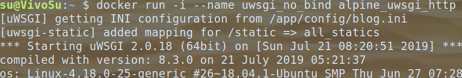
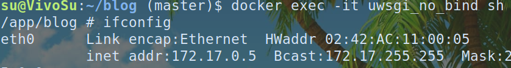
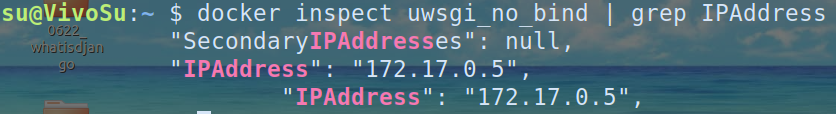
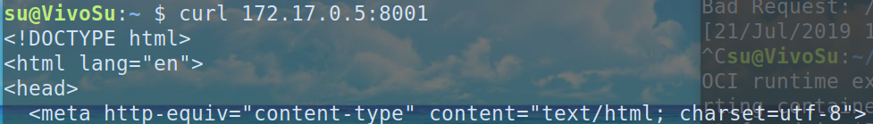

## 20190701

### 요약

전에 아쉬운 점이라고 적었던 대로 url을 하드코딩 보단 변수를 통해 전달하는 방식을 이용해보았다.

이를 통해 url namespace를 나누었고 viewfunction의 이름 또한 깔끔히 다시 정리함.

reply delete 기능을 구현했다

password 인증을 추가했다.


### 내용

#### How to set url namespace

urls.py 에서

 `path("replytest/", include(('reply.urls','reply'), namespace="reply"))`  이와 같은 식으로 namespace를 정해준다.

[출처 stackoverflow](https://stackoverflow.com/questions/51818007/django-social-django-specifying-a-namespace-in-include-without-providing-an-a)


#### url with parameters

만약 variable을 이용하는 url일 경우 그 variable이 적용된 url을 설정하고싶다면

ex) in `urls.py` of an app

```
urlpatterns=[
	...
	path('create/<int:articleId>', views.replyCreate, name="replyCreate"),
	...
]
```

in some htmlfile of another app

```

```

이런 식으로 전달하면 articleId가 14인 reply:replyCreate이라는 이름의 url을 보여준다.

또한 만약 view function에서 template에게 article id를 넘겨준다면 그것을 이용할 수도 있다.

ex ) `` 어떤 변수를 view function에서 넘겨주는 지는 상황마다 다름. 예시일 뿐.

또한 template 의 변수를 어느 영역에서 까지 쓸 수 있나 싶었는데

```
replyid=self.parentElement.getAttribute("replyid")
$.post({
url: "",
 ...
```

이렇게 js 안에서도 쓸 수 있는 것을 보아 어디서든 문자열 자체로 바뀌어 쓸 수 있는 것 같다.

js variable을 url의 argument로 전달해야하는 경우. 예를 들어 var replyId=15 인데

'delete/\<int:id\>' 이런 식의 url을 이용하고 싶은 경우

`delete/<int:id>` 의 url 이외에 `delete/`라는 url을 따로 또 등록해주어서 거기에 js 변수를 append 하는 식으로 이용할 수도 있다.

ex) `url= ""+replyid`  

혹은

[stackoverflow 참조](https://stackoverflow.com/questions/17832194/get-javascript-variables-value-in-django-url-template-tag)

`url= "".replace("9999", replyid),` 이런 식의 트릭을 이용할 수도 있다.


#### 보완활 점

이제 어느 정도 게시판을 가진 홈페이지의 기능정도는 구현했는데, 학교 형이랑 얘기해본 결과 Django 자체의 깊은 수준보다는 AWS services랑 잘 연결 시켜보라는 조언을 듣고 sqlite3 에서 aws DB로 바꾸어 이용해보는 방향을 생각 중.

댓글도 article도 모두 password 가 일치해야 삭제, 수정되게 바꿔야한다. 약간 반복된 노가다..


## 20190702~0704

### 요약

새로운 내용을 배웠다기 보다는 0701에 적었던 대로 article과 comment의 password가 일치할 때에만  수정. 삭제할 수 있도록 구현하는 중이다.


### 내용

특이한 내용 없이 그냥 post로 password와 article 및 content의 내용을 보내고,

pw가 일치할 경우 Delete or Update 하는 식.


### 아쉬운 점 및 보완할 점

update, delete form 은 좀 허접하지만, 기본 HTML로 디자인했다. frontend를 깊이 공부하는 목적이 아니므로.

View count를 적용하고 싶다. -> 그럼 DB model에서 CharField 말고 IntegerField 이런 것도 있나? 있겠지?

미니멀한 디자인으로라도 admin 페이지를 구성해보고싶긴함.

사진이나 동영상, 첨부파일 업로드도 다루어보고싶다. nodejs에서 다루었던 youtube playlist 다운로드를 할 수 있게 하면 재밌을듯.

[class view video](https://www.youtube.com/watch?v=-s7e_Fy6NRU&list=PL-osiE80TeTtoQCKZ03TU5fNfx2UY6U4p&index=10) 에 나온 개념을 이용해서 Article view를 이용해보고싶음.


## 20190705

### 요약

Django의 Class Based View를 이용해보았다.

Article List를 나타낼 때는 ListView를 상속받아 as_view()를 이용해 구현했고, create page는 따로 분리시켰다.

자기 자신을 primary key 로 갖는 model들을 얻을 수 있다.


### 내용

#### class view 써보니까 어떤가

class어제 적었던 대로 class based view를 이용해보았는데, 왜 Django가 기본적으로 제공하는 걸로 빠르고 편리하게 만들 수는 있지만, 자기 입맛에 맞춰 구성하기는 적절하지 않을 수 있다는 지 알 것 같다.

ListView를 이용하든 Detail View를 이용하든, 그것의 기본 용도에 맞춰 쓰기는 편리한데, 섞어서 쓰기는 좀... 그러니까 섞어서 쓰기에는 굳이 이용할 필요가 없음. 그냥 안 쓰는 거랑 비슷. 몇 줄 줄이자고, 새로운 개념을 도입하는 느낌이랄까.

ListView를 이용하는 경우는 DataBase의 **Data를 알아서 pagination 을 해준다는 장점**은 있는 것 같다.


#### 자신을 primary key로 갖는 query set 얻기

예를 들어 Article model이 있고 그 Article model을 primary key로 갖는 Comment model들이 있다고 가정하자.

첫 번째 Article의 Comment 개수를 얻고싶다면

in python

```
article=Article.objects.all()[0]
# print(dir(article)) # 로 목록은 확인 가능.
comments=article.comment_set.all()
print(comment.count())
```

이런 식으로 이용할 수 있고, django template 내에서는 한 Article 객체 변수를 article 이라고 한다면 `article.comment_set.count` 로 Comment 개수를 얻을 수 있다.


### 아쉬운 점, 보완할 점

생각보다 Class Based View가 별로 편리한 지 모르겠어서 조금 아쉽다.

음... blog 자체의 컨셉과는 딱히 필요없을 것 같긴한데, 파일이나 image 업로드 같은 부분이랑 Authentication 부분은 다뤄보긴해야할 것 같고, 이것만 다루면 Django에서 더 할만 한 내용은 딱히 없지 않나 싶다.


## 20190706~0709

### 요약

요즘은 Django 보다는 동아리에서 진행하는 해킹/보안 스터디를 하느라 조금 바빴던 것 같다. 그래도 방학이라고 조금씩 놀러다니기도 했고 ㅎㅎ

주로 웹해킹에 관심이 많았는데 ,XSS나 SQL injection 위주로 배웠고, webhacking.kr 을 이용해 문제를 조금 풀어보기도 했다. 원래 방학 때 DB를 배우면서 MySQL이나 mongoDB를 이용해보려했는데, SQL Injection을 공부하다보니 자연스레 SQL문에는 익숙해진 것 같다.


### 내용

연습단계에서 XSS를 이용해 효과를 보는 것은 사실상 쉽지 않았다. javascript 삽입 자체는 성공했다할지라도 뭔가를 누려보기 위해선 조건이 많이 받쳐줘야했기때문.

그래서 XSS보단 SQL Injection에 관심이 더 가기는 했지만, SQL injection의 경우 내가 볼 땐 주로 php를 이용한 페이지에서 sql문을 다룰 때 사용할 수 있는 것 같은데, 이런 legacy based 웹 말고 Django 나 Flask 등으로 짜여진 modern web에서도 SQL injection이 먹히는 지 의문이다. 아마 거의 먹히지 않는 걸로 알고있다. php에서 이용하던 SQL 문에서 문자열에 장난을 치는 방식을 요즘은 parameter로 정보를 전달하는 형식으로 고쳤다는 것 같았음. 근데 확실하지는 않음.


#### SQL Injection

```
$query="SELECT id, name FROM users WHERE id='$id' LIMIT 1";
$result=mysql_query(query);
```

이러한  php source가 있다면 내가 $id에 문자열로서 '  or 1=1; -- 이러한 방식으로 전달한다면

```
$query="SELECT id, name FROM users WHERE id='' or 1=1;--
$result=mysql_query(query);
```

과 같은 결과를 얻어 모든 user의 정보를 얻을 수 있게되는 것이다.

single quotation, 주석 등등에 대한 다양한 우회방법이 있지만 그러한 우회방법이 어떤 방식들인지만 알고 암기할 정도는 아닌 것 같다.


#### SQL Injection - union

union이란 SELECT 문 두개를 묶어주는 역할을 해주는 것인데, 이 때, 두 SELECT문이 선택하는 Column들의 개수가 같아야한다.

`select id, name from users where id='$id' `를 SQL injection을 통해

`select id, name from users where id='' and 1=0 union select id, pw from users;`

이런 식으로 만들어주면 원래의 SQL 문에서 얻으려던 정보 이외의 것을 얻을 수도 있다.


### 근황

요즘 방학하고 이래저래 일도 많고 개인사정도 있어 공부를 제대로 진행은 못하고있다. 중순부턴 다시 조금씩 가다듬어 공부하고 여행도 다니고 해야겠다.


## 20190710

### 요약

동아리에서 시스템해킹 관련하여 어셈블리어를 살짝 배웠는데, 이곳에 정리하긴 애매하여 생략한다.


## 20190714

### 요약

각종 칼리 리눅스를 이용한 built in hacking tool 중 쓸만한 게 뭐가 있을 지 조금 알아봤다.

Brute Force를 위한 Hydra 나 port 나 os 를 scan해주는 NMap등을 간단히 사용해보았다.

간단히 nmap의 사용예시를 보면


위의 사진처럼 해당 ip 주소의 컴퓨터의 포트정보를 알 수 있다.


## 20190715

### 요약

Django pagination에 대해 좀 더 알아보았다.

Apache 와 Tomcat, Nginx등에 대한 기초 개념을 알아봤다.

Django와 Apache, nginx 등의 차이점을 알아보고 어떤 방식으로 연동하는 지 알아보았다.


### 내용

간단히 말해 Apache 나 Nginx는 웹서버 자체를 관리해주는 소프트웨어고

Django와 같은 Web Framework는 Web Application을 만드는 framework이다.

Django 나 express 자체로도 web server를 구축할 수는 있지만 여러모로 비효율적이고 불안정하기 때문에 Apache나 Nginx를 이용한다고 한다.

Legacy의 경우 Apache를 이용하고 요즘에는 대부분 Nginx를 이용하는 추세라고한다.


나는 본래에 Apache나 Nginx 는 static한 file만을 제공하는 줄 알았는데, 내가 생각했던 바와는 다르게, 로드밸런싱을 하기도 하고 caching과 관련된 기능을 한단다. 원래는 js, css, jpeg 이런 file 제공용으로만 apache를 이용하는 줄 알았는데, 웹서버를 돌리는 nginx 에 django application을 올리는 식인 것 같다.

또한 django 나 express로 웹서버를 돌리면 프로그램이 트래픽 증가로 인해 튕겨버릴 경우 그래도 종료되지만, nginx 등은 그러한 것에 대비해 kubernetes에서 replica수를 유지하듯, 서버의 상태를 유지하도록 도와주는 것 같다.


### 다음에 할 것

오늘은 개념적인 면에서만 알아보았기 때문에 정확히는 모르는데, 추후에는 nginx에 Django blog app을 올려보아야겠다.


## 20190716

### AWS EC2 Instance에 Nginx 설치하고 Nginx Beginners Guide 따라해봄.

### reverse proxy vs load balancer

load balancing은 그냥 말 그대로 적절히 접속하는 IP를 분산시켜 과부하를 막아줌. 다양한 protocol에서 사용

reverse proxy는 load balancing 기능을 하기도 하고 caching이나 보안적 이득도 있음.

reverse proxy 에서 proxy는 겉에만 나와있고, backend와 client가 직접 소통하지않으므로 보안적 이득이 있고 server의 content를 caching하여 저장함으로써 효율이 있음. 

예를 들어 `nginx`에서 `nginx -s reload`를 이용해 cacing된 content를 reload 할 수 있는 듯.

( 근데 왜 reverse proxy는 web 관련 protocol에서만 사용 가능하는 지는 모르곘네. )

[stack exchange 참고](https://serverfault.com/questions/127021/what-is-the-difference-between-load-balancer-and-reverse-proxy)


### nginx vs kubernetes

nginx 도 load balancing을 해주고 kubernetes도 load balancing을 해주는데, 왜 굳이 Pod에 Nginx를 넣는 것임?

자세히는 모르겠당.

static file  제공은 python이나 node.js로도 가능하다.

load balancing도 k8s로 가능하다.

server 유지도 k8s의 replica유지로 가능하다.

nginx의 log나 속도 및 리소스 조절 때문인가?


## 20190718

### 요약

python venv 를 이용해봄

nginx 웹서버와 Django Web Applicatio을 연동하기에 앞서 uWSGI를 이용해 웹서버를 구축해봄


### 내용

#### how to use python venv

[install python venv](https://medium.com/도서-파이썬-웹프로그래밍-실전편-요약/chapter-6-가상-환경-사용하기-새롭게-정리-30d5940de012)  에 잘 나와있지만 install 되지않는다면 `apt install python3-dev`를 입력해보자

이 때 주의할 점은 자신의 패키지 매니저 (apt)가 지원하는 python version과 자신이 사용중인 python의 version이 동일한 지 알아야한다.


사진에서처럼 나는 python 이라는 명령어로 python3.7x를 이용중인데 apt 를 통해 install 되는 python3-dev와 python-venv 등은 3.6x를 지원하는 것 같다.

따라서 동일하게 3.6x버전의 python을 이용했을 때 성공적으로 virtual environment가 생성되는 것을 알 수 있다.

생성된 디렉토리로 들어가서 `source bin/activate` 를 통해 virtual env를 이용할 수 있고, terminal에 표시가 난다.

venv를 종료하려면 `deactivate`를 입력하면 된다.


#### uWSGI를 이용해 Django app 작동시키기.

우선 서버를 운영하면서 중요한 것은 나의 app을 편리하게 배포하는 것이 아닐까 싶다. orchestration으로 replica수를 조절할 때나 다양한 node에서 나의 app을 run 시킬 때마다 배포할 때 수정해야 하는 사항이 많다면 불편할 것이다.

그래서 우선 내 app을 배포한다는 가정하에 venv를 이용해 조금은 독립적인 작업환경을 구축해보았고,

이젠 Nginx를 이용하기에 앞서 uWSGI를 이용해  내 앱을 서버를 통해 노출시켜보겠다.

우선은 **.ini** 파일을 이용해 uWSGI의 설정 즉 내 서버의 설정을 저장할 수 있다.

다양한 블로그를 참고했는데, nginx를 배울 때 조금 어려웠던 점은 글마다 설정이 달라서 뭐가 뭔지 좀 헷갈렸다는 거.. 이상하게 유튜브에도 단순 static file 제공 영상 외에는 많은 영상이 없더라

https://twpower.github.io/43-run-uwsgi-by-using-ini-file

https://uwsgi-docs.readthedocs.io/en/latest/StaticFiles.html#mode-3-using-static-file-mount-points

https://yiunsr.tistory.com/749

https://www.devdungeon.com/content/how-deploy-django-nginx-and-uwsgi

https://crystalcube.co.kr/205


아주 간단하게 .ini 설정없이 uwsgi를 이용해보고싶다면

`uwsgi --http :8080 --module={project name}.wsgi` 등을 이용해 한 줄 만으로도 자신의 django app을 `http://127.0.0.1:8080/` 등에 노출시켜볼 수 있다. (project name 수정하고, static file, node 수 등등 대부분의 설정 디폴트임 그냥)

**Django app이 어떠한 작업을 하도록 ( 스레드를 수행할 수 있도록 )해야만 Application이 원활히 돌아갈 수도 있다.** 내 application의 경우 `.ini` 파일에서 enable_threads=true 로 해줘야했음.


#### 자신의 Django app을 uWSGI나 nginx 등과 연동하려할 때 static file을 편리하게 이용하는 방법

우선 절차는 이러하다. Django Project의 기본 static 디렉토리, app 별 static 디렉토리에 있는 모든 파일과 디렉토리를 한 디렉토리에 저장한다. -> 그 디렉토리를 uWSGI나 nginx에서 static 디렉토리로 등록한다.

Django project의 `settings.py`에서 `STATIC_ROOT='/django_static'` 이런식으로 static 파일과 디렉토리를 모두 모아 저장할 위치를 정의해주고

`python manage.py collectstatic`을 통해 static 파일들을 실제로 저장한다.

이후 `ini`파일에서 `static-map = /django_static` 등으로 static file들의 경로를 지정한다.

쉽게말해 원래 django project에서 이용하던 static 디렉토리 작업은 uWSGI를 이용할 땐 수행되지 않고 uWSGI의 static 디렉토리를 이용하는 셈이다.


### 오늘의 피드백

생각보다 꽤 공부가 잘 되었고, uWSGI 튜토리얼 정도까지는 마무리할 수 있었는데 아직 uWSGI자체가 뭔지, Nginx랑은 무슨 관련인지는 자세히 모르고 설정 또한 자세히는 모르니 이 부분을 좀 더 공부해봐야겠는데, Nginx와 WSGI 부분은 왜이렇게 잘 정리된 글들이 없고 다 중구난방이냐.. 공부하기 쉽지 않다 책을 빌릴까 생각 중

아래 영상은 꽤 유익한 것 같아서 내일 볼 예정!

https://www.youtube.com/watch?v=dVEjSmKFUVI


## 20190719

### 요약

nginx와 python app, uwsgi를 이용하는 법을 알아봄.

uWSGI에 대해 좀 더 알아봄


### 내용

#### uWSGI?

https://brownbears.tistory.com/350 에도 설명이 잘 나와있지만 WSGI란 python application이 web server와 통신하기위한 interface이다. Django나 Flask는 이러한 interface를 지원한다. 그 중 uWSGI는 그러한 인터페이스를 구현한 소프트웨어 중 하나인 것이다.

-> nginx는 기본적으로는 static file을 제공하지만 nginx에 uWSGI를 이용해 application을 올려서 dynamically created files를 제공할 수 있다.


#### Client, Nginx, uWSGI, DJango App 이 소통하는 방식

##### 만약 uWSGI로 Django App을 이용한 웹 서버를 운영한다면 

절차는 client request to IP or DNS with HTTP or HTTPS -> uWSGI ->Django App. 이다.

여기선 uWSGI가 HTTP로 통신하므로 `.ini` file 에 

`http 127.0.0.1:8001` 이런 식으로 적어주어야한다.

이때의 ip:port는 client가 직접 접속하는 주소이다.


##### 만약 Nginx를 거쳐서 uWSGI로 Django App을 돌린다면

절차는 client request to IP or DNAS with HTTP or HTTPS -> Nginx --(uWSGI protocol)--> uWSGI -> Django App 이다.

받아들여야할 내용은 Nginx 와 uWSGI는 HTTP/S protocol을 이용하는 것이 아니라, 소켓을 통한 **uWSGI protocol**을 이용한다는 것이다.

이 내용을 몰라 한참을 삽질했다... ㅎ.. [나의 stackoverflow 질문](https://stackoverflow.com/questions/57112428/what-are-the-differences-between-http-and-socket-inside-of-ini-file-in-uwsgi)을 참고하자.


무튼 그래서 경우에 따라 uWSGI의 `.ini`에 `socket {host}:{portNumber}` 혹은 `http {host}:{portNumber}` 로 적어주어야한다.

#### uWSGI 만으로 웹애플리케이션과 웹서버 돌리기, Nginx와 uWSGI를 이용해 웹애플리케이션과 웹서버 돌리기

내용이 너무 길어서 생략한다..;;


### 보완할 점

어제 오늘 공부를 통해 대충 Webserver 자체나 Nginx, uWSGI에 대한 개념은 잡힌 것 같지만, 아직 제대로 써먹거나 설정을 하는 방법은 자세히 모른다. 좀 더 설정하는 방법을 알아보도록해야겠다.

`.ini` file에서 `plugin=python`으로  명시하는데, 이 때 어떤 path의 python과 pip를 이용하는지, 어떻게 변경하는 지 알아봐야겠다.

-> 몇가지 도움이 될만한 코드들을 알아왔다.

```shell
which uwsgi
pip list --verbose # 해당 pip가 관리하는 package 를 보여줌 여기서 uwsgi가 어디에 설치되어있나 볼 수 있음.
uwsgi --pyshell -s 127.0.0.01:8080 # python shell 을 실행해서 python version을 확인해볼 수 있음.
```


## 20190720

### 요약

Django app 과 Nginx, uWSGI를 연동하는 것이 능숙해졌다.

virtualenv를 사용하는 것 또한 능숙해졌다.

간단한 Django App을 Docker, uwsgi 를 이용해 실행해봄.


### 내용

uwsgi의 `.ini` file에 대한 몇 가지 팁

`static-map = /static=all_statics # chdir 기준 경로`

static-map은 chdir을 기준으로 상대경로를 이용할 수 있다.

`home`은 virtual env의 경로를 적는 곳인데, 적지 않아도 된다.


### 피드백

자세한 내용들은 좀 적기는 애매한 내용들이라 생략하는데, 그냥 nginx, uwsgi 로만은 배포가 힘든 것 같고 docker image를 만드는 것이 배포하기 적절한 것 같다.

`.ini` file 안의 절대경로 지정이나

`.conf`file에서 server의 주소를 적거나 전역으로 nginx를 설치하는 등등 단순히 python virtual env로 하긴 좀 힘들기도 하고 공유하기도 힘들어서

docker image를 이용하는 게 나아보인다.

어떤 도커 이미지를 쓸 지가 약간 고민이다. uwsgi를 편리하게 설치할 수 있는 Docker image가 무엇이 있을지..


## 20190721

### 요약

docker container의 IP 와 network에 대해 좀 더 알게됨

- Container는 각각 IP를 갖고있다 ( Pod 안에 있을 땐 다르긴 함 ) [참고글](https://www.quora.com/Does-each-container-have-its-own-IP-address)

- `docker run -p`  에서 Port Binding을 하지 않아도 container의 IP와 Port로 호스트도 컨테이너 내부에 접근할 수 있다.

- 쉽게쉽게 생각하자면 `0.0.0.0`은 자신의 IP로 치환 가능, `127.0.0.1` 은 말그대로 자신만 접근 가능한 localhost

- docker-compose 에서 container-name을 통해 container ip 대신 containername으로 통신가능.

  

Docker 를 이용해 Django-uwsgi, Nginx 컨테이너로 배포할 수 있어짐.


### 내용

Docker와 Kubernetes를 배우던 수업 때 container는 고유의 IP를 갖지 못한다는 게 K8s의 Pod와 다른 점이라는 소리를 들어서인지. 그동안 container는 IP를 갖지 않는 줄 알았다.

그래서 그냥 container의 127.0.0.1은 컨테이너의 로컬호스트이고 0.0.0.0은 Host의 127.0.0.1과 동일한 것인 줄 알았고 그래서 컨테이너의 0.0.0.0을 이용함으로써 호스트와 소통할 수 있는 줄 알았다.

예를 들어 컨테이너에서 돌리는 서버를 host에서 접속하려면 컨테이너에서 0.0.0.0:8000에 서버를 run 시킨다면

docker run -p 8001:8000 imageName 을 통해 컨테이너의 0.0.0.0:8000을 Host의 127.0.0.1:8001에 바인딩시킨다고 생각했다. 하지만 이것은 틀린 생각이었다.

애초에 0.0.0.0 과 127.0.0.1의 차이를 잘 몰랐던 것 때문인 것 같기도 하다.

쉽게 생각하자면 127.0.0.1은 localhost와 동일한 말로 말 그대로 내 로컬에서만 접속가능한 내 network 환경만의 서버이다.

하지만 **0.0.0.0은 나의 자신의 내부 IP**를 가리키는 듯 하다.

무슨 소리냐면 내 컴퓨터의 내부 IP가 192.168.219.15, container의 내부 IP가 172.17.0.4, 172.17.0.5 라고 해보자

내 로컬 머신에서의 0.0.0.0은 192.168.219.15 이고 내부 IP 172.17.0.4 의 container에서의 0.0.0.0은 172.17.0.4이다.

따라서 컨테이너에서 0.0.0.0을 이용하는 것은 컨테이너 자신은 IP가 없고 0.0.0.0을 통해 Host의 127.0.0.1을 이용한다는 뜻이 아니라 ( **난 애초에 0.0.0.0이 외부아이피인줄알았음...** ) 0.0.0.0 은 자기 자신의 아이피 ( 예를 들면 172.17.0.4)을 이용한다는 뜻일 뿐이다. ( 자신의 0.0.0.0을 통해선 자신의 127.0.0.1 로도 접속가능)


예를 들어보자

`docker run -p 8001:8000 --name django_app django` django image를 바탕으로한 컨테이너를 실행시키며 host의 8001포트와 Container의 8000번 포트를 바인딩 시킨다. 컨테이너의 이름은 django_app이다.

`docker inspect django_app | grep IPAddress` 를 통해 django_app 이름의 컨테이너의 IPAddress를 확인해보자. 예를 들어 172.17.0.4라고 하자.

django_app 컨테이너는 `python manage.py runserver 0.0.0.0:8000 ` 를 수행한다고 하자.

그럼 컨테이너의 `0.0.0.0:8000` 은 `172.17.0.4:8000` 과 같고 이는 같은 공유기 내의 어떠한 네트워크에서도 172.17.0.4:8000 로 접속할 수 있다. 

그리고 처음에 컨테이너를 실행할 때 host의 8001 포트를 컨테이너의 8000번 포트와 바인딩시켰기때문에 host에서는 `0.0.0.0:8000`과 `127.0.0.1:8000`으로 접속할 수 있으며 컨테이너의 아이피:포트인 `172.17.0.4:8000`에도 접근할 수 있다.

한 가지 놀라웠던 건 `docker run -p`는 포트를 호스트의 포트와 바인딩할 뿐이라서, -p 옵션없이도, 컨테이너의 IP:Port를 이용하면 컨테이너에 접속할 수 있더라!

#### 예시



0.0.0.0:8001번 포트를 이용하는 uwsgi container 실행



해당 컨테이너의 쉘 안에서 `ifconfig`를 통해 본 IP

host 에서 `docker inspect`를 통해 본 방금 그 컨테이너의 IP. 동일하다.

외부에서 해당 컨테이너에 `-p` 옵션을 통한 포트바인딩없이 접속하는 모습.




### 피드백

uwsgi container와 nginx 컨테이너가 잘 소통할 수 있도록 docker-compose를 이용해봐야겠다.

사실 network 부분에서 왜 nginx container의 `.conf`에서 upstream으로 uwsgi container를 참조해야하는데 왜 0.0.0.0:8001으로 참조해야하는지 몰라서 의문이었는데, 0.0.0.0 과 docker의 네트워크 방식에 대해 알게 되면서, container 내부의 0.0.0.0 은 컨테이너 자신의 IP라는 것을 알게되었다.


## 20190723

### 요약

nginx와 uwsgi에 대해 official documents를 비롯하여 여러 자료들로 좀 더 공부해보았다.

주로 nginx 의 load balancing에 대해 공부해보았다.


### 내용


## 20190724

### 내용

한동안 보안 관련 공부를 하느라 바빴던 것 같다. 주제가 보안이라 딱히 이곳에 적긴 힘들 것 같은데

 사실 보안 공부를 하면서 드는 의문이 있다. 주로 웹 해킹에 관심이 있는데, 사실상 SQL injection이나 php injection, XSS 공격을 요즘 생겨나는 혹은 대규모의 사이트에 시도해볼 수 있는지가 의문이다.

사실상 ORM이나 parameterization등으로 SQL은 막히는 게 현실적인 것 같고, php injection등등도 upload시 `.php` 파일을 막거나 확장자가 없는 이름으로 업로드를 시켜버려서 쉽지 않다.

XSS 또한 사실상 시도를 할 때마다 댓글을 달거나 게시물을 게시하는 식으로 해야하기 때문에 흔적도 많이 남고 쉽지 않다.


그래서 현실적으로 어떤 방법으로 웹해킹을 해낼 수 있을 지, 아직 XSS나 SQL Injection 으로도 가능하다면 어떠한 방식으로 가능할 지 궁금하다.


## 20190725

### 요약

AWSKRUG 의 아키텍처 소모임을 가서 GraphQL과 AWS의 Timeline에 대해 간단히 알아보았다.

내용이 좀 어려웠지만 열심히 해야겠다는 생각도 들게 됐고, 재미있었다.


