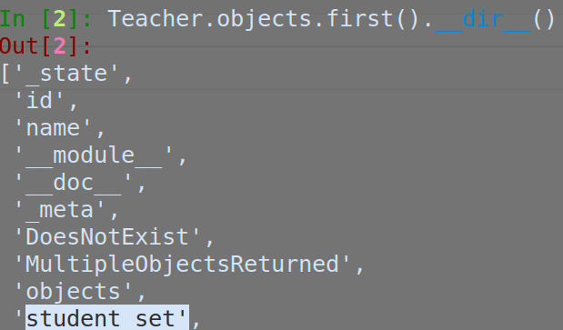

## 20190803

### 내용

요즘은 갑자기 Android App을 조금 만들어보고있다.

ausg 지원서 쓰다가 든 생각이기도 하고, 요즘 Youtube보면서 든 생각이기도 한데, 정말 플레이 스토어 수수료 좀 물더라도 서비스를 하나 런칭해보고 싶기는해서.

원래도 그런 생각이긴했지만 생각보다 django blog는 이제 어느정도 원했던 정도까지는 나와서 ( 생각보다 Django 가 참 좋더라...;;; )

며칠 동안 코딩 테스트 공부했는데 어제 오늘은 안드로이드 하느라고 시간이 다 갔네.

우선은 Django로 간단하게 REST API 짜놓고 안드로이드로 프론트 앱 만드는 중이다.

얼른얼른 만들어야지.


## 20190810

### 내용

만들던 Android App이 다양한 기능도 넣고 규모가 커지면서 조금 복잡해졌다. 생각보다 프로젝트의 구조를 짜거나 데이터를 모델링 하는 게 그리 단순하지만은 않더라.

요즘 백준에서 알고리즘도 공부하고 있으면서 안드로이드 시간 쪼개서 급한 대로 개발을 하다 보니 조금 꼬인 것 같아서, 잠시 중단하고, 알고리즘을 좀 공부 중이다.


## 20190815

### 브루트포스

알고리즘 문제를 푸는 데 브루트포스를 간간히 이용하긴 하는데, 매번 사용할 때 마다 한 번에 사용법이 깔끔히 떠오르진 않는다. 내가 주로 이용하는 기본적인 퍼뮤테이션 코드는 아래와 같다.

```python
def brute(l, candidates):
    if len(l) == len(totalList):
        print(l)
    else:
        for c in candidates:
            _candidates=candidates[:]
            _candidates.remove(c)
            brute(l+[c], _candidates)
 
n = int(input())
totalList = list(range(1, n+1))
brute([], totalList)
```


내가 주로 사용하는 브루트포스나 DP 방식이 있는데( 예를 들면 재귀나 리스트의 길이를 통해 메모이제이션으로 저장해놓은 데이터가 있는지 보는 방식 ) 이 외에도 다양한 방식이 있으니 문제를 푼 뒤 다른 사람들은 어떻게 풀었나도 보고 다른 풀이방식은 어떤 게 있을 지 체크해보려 노력해야겠다.


## 20190816

### Dynamic Programming

가장 재미있어하는? 알고리즘 문제 유형 중 하나이다. 어려운 듯 하지만 어떻게 풀 지 감은 오는 유형이랄까?

보통은 DP 문제는 `f(n) = f(n-1)+f(n-2)` 와 같은 점화식을 이용하는 경우가 많은 것 같다. 그래서 우선은 점화식이나 각 항들의 관계를 찾아내는 것이 중요한 것 같다. 쉬운 점화식은 피보나치와 같은 형태이고 조금 어려운 점화식은

`f(n) = g(n) + h(n)`

`g(n) = a * g(n-1) + b * g(n-2)` , `h(n) = c * h(n-1) + d * h(n-2)`

와 같이 여러 식이 혼합 될 수 있겠다.


[[백준 11053번 가장 긴 증가 부분 수열]](https://www.acmicpc.net/problem/11053)

[[백준 11055번] 가장 큰 증가 부분 수열](https://www.acmicpc.net/problem/11055)  같은 문제로 넘어가면 조금 어려운 DP가 된다. 단순히 피보나치와 같은 점화식만으로는 풀 수 없다. 그래서 이러한 경우에는 문제가 의미하는 바가 무엇인지 정확하게 파악하고 이전 항들을 어떻게 이용해서 다음 항을 정의할 지 알아내어야한다.

예를 들어 ` 10 20 10 30 20 50` 의 수열에서 가장 길이가 긴 부분 증가 수열을 구한다면

`10 20 30 50`이 될 것이다.

1. [0]인 10 까지의 가장 긴 증가수열은 {10}으로 길이 1

2. [1]인 20 까지의 가장 긴 증가수열은 1번의 수열에 20을 추가해 {10, 20} 길이 2

3. 여기서부터 생각이 필요하다. [2]인 10 까지의 가장 긴 수열은 1.2 과정에서 구한 수열 중 끝 값이 자신 보다 작은 수열 중 가장 긴 수열에 자신을 추가함으로써 **자신을 꼭 포함한** 가장 긴 증가 수열을 만들 수 있다. 
   하지만 끝 값이 자신보다 작은 수열이 없으므로 그냥 자신만 포함하는 {10} 으로 길이 1

4. [3]인 30 까지의 가장 긴 증가수열을 구해보자

   나보다 끝 값이 작은 {10}, {10, 20} 중 가장 긴 증가수열에 자신을 포함함으로써 {10,20,30} 으로 길이 3

5. [4]인 20보다 끝 값이 작은 증가수열 중 가장 긴 증가수열에 자신을 포함시켜보자

   {10,20} 으로 길이 2

6. 같은 방식으로 4.의 수열에 자신을 추가함으로써 {10,20,30,50}으로 길이 4

마지막으론 각 자신을 끝 값으로 하는 수열의 길이들 중 최댓값을 구하면 된다.

자신보다 앞의 값들로 이루어진 수열들의 길이와 끝값을 이용해 길이가 가장 긴 수열에 자신을 포함시킨다는 것으로 문제를 간단히 하여 풀어내는 것이 포인트다. 처음엔 이해하기 쉽지 않다.....


## 20190818

### 간단한 django model relations

ForeignKeyField를 이용해 1:M의 관계를 나타낼 수도 있고

ManyToManyField를 이용해 M:N의 관계를 나타낼 수 있다.

M:N의 경우 서로 중 누가 ManyToManyField를 정하든 크게 상관은 없는 것 같다.

```python
from django.db import models

# Create your models here.
class Teacher(models.Model):
    name=models.CharField(max_length=15)

class Student(models.Model):
    name=models.CharField(max_length=15)
    teach=models.ManyToManyField(Teacher)
    #teach=models.ForeignKeyField(Teacher, on_delete=models.CASCADE)
```


예를 들어 한 학생이 여러 선생님의 수업을 듣고, 한 선생님 또한 여러 학생을 관리하는 경우.

위와 같이 모델링했을 때 `Teacher.objects.first().student_set` 을 통해 선생님 오브젝트가 갖는 students에 접근할 수도 있고, `Studnet.objects.first().teach` 를 통해서도 학생이 듣는 수업의 선생님 오브젝트에 접근할 수도 있다.

만약 "Teacher Foo"라는 이름의 선생님의 수업을 듣는 학생들을 고를 필터해내고 싶다면

`Teacher.objects.get(name = "Teacher Foo").student_set` 을 통해서도 학생들을 필터해낼 수 있고

`Student.objects.filter(teach=Teacher.objects.get(name="Teacher Foo"))` 이렇게 name이 "Teacher Foo" 은 오브젝트 자체를 구해서 filter 해 낼 수도 있다. 아마 전자가 편해보이긴한다.

혹은 "Teacher Foo" 의 id 를 아는 경우는

`Student.objects.filter(teach_id=1)` 이런 식으로 "Teacher Foo" 오브젝트의 id 자체를 인자로 넘겨서 필터해낼 수도 있긴하다.


쉽게 생각하면, ManyToMany 이든 ForeignKey든 XXXField를 갖는 녀석은 자신이 필드로 가진 column에 대해 column name 자체로 접근이 가능하고, 자신이 Field로 가져진 녀석은 자신을 Field로 가지는 녀석의 데이터 이름에 _set을 붙인 queryset에 접근이 가능하다.


## 20190824(여행다녀옴)

### 요약

일주일 내내 여행 갔다오느라고 바빴다. 멘탈도 많이 회복하며 힐링할 수 있었던 것 같다. 다시 개강 전까지 스퍼트 조금만 올려서 앱 개발에 힘써야겠다!

복잡해진 DB 구조 탓에 난관이었는데, 다시 차근차근 파악해보며 `ManyToMany`의 경우 효율적으로 원하는 `set`만 `filter`해 낼 수 있도록 하는 `function`을 정의해서 사용해보았다


### 개발 중인 앱에서 보완해야할 부분들

* 각종 UI가 직관적이지 못하고 사용하지 불편한 경우가 있음.
* Activity 스택을 좀 관리해야겠음. 뒤로가기 너무 많이 눌러야돼..
* REST API의 보안 문제. REST API의 통일성 및 구조 문제. 너무 막 만들어서 쓰다보니까 통일성이 없음.
* Android JAVA Project Package 구조 깔끔하게 구성하기.


## 20190825

### 요약

만들고 있는 앱에서 점수를 나타내는 페이지를 자신의 점수 밖에 못 봤는데,

리스트뷰를 이용해서 모든 사람의 점수를 볼 수 있게 구성함.


## 20190826

### 요약

* Activity마다 toolbar 설정과 Drawer 설정을 다 복붙해서 넣었었는데, DrawerSetter라는 클래스를 정의해서 편리하게 업데이트했다. ( 원래는 한 내용이 바뀌면 Activity 마다 다 돌아다니면서 작업했어야함 )
* FoodExam에 대해 Delete 기능을 추가했다. 사실 Exam에 참여한 사람들에 대한 Delete는 어려울 수 있는데, 며칠 전에 잘 짜놓은 Exam -> 참여자로 접근하는 함수 덕분에 편리하게 Delete 할 수 있었다.
* AlertDialog를 Layout xml로도 정의해보았다. 근데 AlertDialog나 Inflater 관련해서는 좀 더 알아보아야할듯.

### 정리

아무래도 8월달은 여행도 있었고 앱 개발도 있었는데, 앱 개발 같은 경우에는 모두 공개하기 힘든 부분도 있었고, 급하게 기능들을 추가해나가다보니, TIL로 정리하기도 좀 힘든 면이 있었다. 급하게 개발을 하다보니 대충 넘어간 개념들도 있고 위태로운 기능들도 있었는데, 9월 중순쯤부터는 어느정도 개발시켜놓은 것들을 수정하고, 디자인도 개선하는 방향으로 해야할듯!


