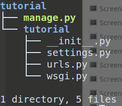
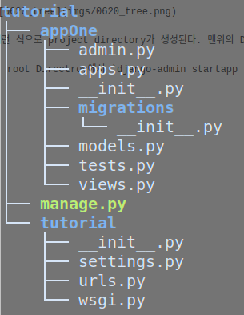
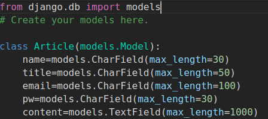

## 20190620

Django 공부를 시작했다. Youtube에서 아주 좋은 인강을 찾아서 그거보고 방학 때 공부하면 Django를 어느정도 이해하고 사용할 수 있을 것 같다.

[Corey Schafer ](https://www.youtube.com/watch?v=UmljXZIypDc&list=PL-osiE80TeTtoQCKZ03TU5fNfx2UY6U4p)

**우선 Django는 Flask와 달리 django-amdin command와 manage.py에 인자를 전달함으로써 애플리케이션을 이용한다.**

이 부분으로 인해, 코딩 자체보단 Django 관련 command들의 이해와 Framework의 Structure를 이해하는 게 중요한 것 같다.

### 요약

`django-admin startproject {projectName}`  and `django-admin startapp {appName]`

django project Structure에 대해. router 설정하는 대략적 방법. view functions를 전달하는 방법.

`python manage.py runserver`

### 내용

`django-admin startproject {projectName} `  으로 project를 만든다.

projectName Directroy 안에 manage.py와 다시 projectName 이라는 Directory가 생긴다.



이런 식으로 project directory가 생성된다. 맨위의 Directory 를 root Directory라고 하겠다

그 root Directroy에서 `django-admin startapp {appName}`  으로 project내의 app을 만든다.



tutorial directory의 내부의 

&#95;&#95;init&#95;&#95;.py"는 그냥 얘네가 패키지라는 것을 알려주기 위함이고

settings.py는 내가 생성한 project에 관한 설정들을 python file로 저장해놓는 곳이다.

urls.py 는 router를 설정하는 파일이다.

__app__ directory 에서 내가 관리할 file은

`views.py` 와 `urls.py`이다.

`urls.py`는 내가 새로 만들어야하는 파일이다. tutorial directory `urls.py`와 같은 형식으로 참고해서 적어주자

이 때의 root 경로는 내가 나중에 tutorial directory의 `urls.py` 에서 설정하기 나름이다. 만약에 `blog/` 다음의 router들을 생성하고 있다면, tutorial/urls.py에서 `"blog/"` 에 대한 view function에 indclude("appOne.urls") 이런 식으로 정의해주면. 알아서 appOne/urls.py의 경로가 `blog/` 

`views.py` 가 비로소 드디어 client가 해당 url에 접속했을 때 수행할 view functions를 정의하는 공간이다.

django.http의 HttpResponse모듈을 이용해 client에게 response를 전달한다.


## 20190622

### 요약

smtplib 모듈을 이용해 email을 보내봤다. 자세히는 아직 다루지 못했지만, 작동은 한다.

패키지에 대한 이해가 조금 필요할 듯하다. 그냥 간단하게 조금 확인해보고싶어서 temp.py 등으로 임의로 테스트 해보려는데 패키지가 아니면 모듈을 이용할 수 없다는둥 이래저래 오류가 많이 뜨더라.

Template을 이용해 html file을 정의하는 법에 조금 익숙해졌다. `base.html`을 만들어 `guestbook.html`이 상속받을 수 있게 설계했다.

SQLite3 DB를 이용하는 법을 배웠다.

### 내용

#### How to use SQLite 

자신의 app의 디렉토리에 있는 models.py로 가준다.



이런 식으로 적절히 django.db의 models.Model 클래스를 상속받는 나의 데이터 model 클래스를 정의한다.

app의 모델을 정의했으면 `manage.py`가 있는 프로젝트의 root directory로 가서 

`python manage.py makemigrations blogApp`  을 통해 blogApp의 db model을 다시 만들어주고

`python manage.py migrate blogApp`  을 통해 내 프로젝트의 db에 적용해준다.


#### 기타 template 사용법
in base.html

    
    

in guestbook.html ( 예를들어 )

    
    
    추가하고픈 내용
    


## 20190623

### 요약

django 에서 DB를 다루는 법을 좀 더 알 게 되었다.

POST 로 전달받은 Guestbook 내용을 통해 DB에 정보를 추가할 수 있어졌다.

Bootstrap 의 Grid Layout에 대해 좀 더 감이 잡혔다.

template에 인자를 전달하고 사용해보았다.

### 내용

#### DB 다루는법

나의 Django Projcet의 DBShell을 이용하려면 ( 나의 경우 SQLite3 )

`python manage.py dbshell` or 

```
$ sqlite3
$ .open {DB File Name} 
```

을 통해 가능하다.

참고로 sqlite3 shell을 이용하고 싶다면 따로 설치해주어야하고.

```
python manage.py shell
>>> from {app name.models} import {modelName}
>>> {modelName}.objects.all()
>>> {modelName}.objects.filter(name="test").delte()
```

등으로도 DB를 관리할 수 있다.

`python manage.py sqlmigrate {appName} {migrateNumber}`

을 통해 SQL language로 해당 migration을 할 때 어떤 작업을 수행하는 지 볼 수 있다


#### Django Query

view function이 인자로 받는 request를 이용해

`request.POST.get("이름")` or `request.GET.get("이름")` or `request.GET["이름"]` 등등으로 query data를 얻을 수 있다.


#### template에 인자 전달하기

in view function definition

```
dataObject={"articles":Article.objects.all()}
return render(request, "blogApp/guestbook.html", dataObject)
```

위와같이 QuerySet을 다시 dictionary 등에 대입하여 전달한다.


#### Bootstrap Grid

row는 margin -15px

col은 padding +15px

container -> row -> col 순으로 배열해야하는데

row 전에는 한 번이라도 container가 와야 깔끔히 사용가능하고 그 이후엔

row->col만 써도 깔끔. 계속 container->row->col 식으로 사용하면 점점 좁아짐.


#### 보완할 점 및 궁금한 점

html file의 structure가 좀 더러워서 bootstrap도 좀 더 개념을 잡으면서 정리해보고 싶긴한데, front 보단 backend에 더 관심이 많아서 일단 보류함.

POST request에 대해 response를 보낼 때 view function에 decorator로 @csrf_exempt  이걸 적던데, 왜 쓰는 건지...?

guestbook delete는 구현헀는데, guestbook modify는 새로 수정창을 열어야해서 어떻게 구현할 지 고민 중..


## 20190624

### 요약

aws ec2 instance를 이용해 server을 돌렸다.


### 내용

#### EC2 Instance로 서버돌리기

포트와 아이피가 어떤 식으로 바인딩되는 지에 대한 이해가 있어야 명확히 서버를 돌리고 포트를 바인딩 하는 원리를 알 수 있다.

우선은 nohup을 통해 background 에서 detach mode로 python을 실행시킬 수 있었다.

ex) `nohup python manage.py runserver 0:80 &` 

#### 시간 이용하기

models.py 에서 `from django.utils import timezone`과

테이블의 요소로서 `time=models.DateTimeField(default=timezone.now)`로 함수의 리턴값이 아닌 now라는 함수 자체를 default의 값으로 전달한다.

이후 template에서는 [Django date filter](https://docs.djangoproject.com/en/2.2/ref/templates/builtins/#date) 참고하여 time및date를 이용할 수 있다. ex) `{{ article.time|date:"Y.m.d. H:i" }}`


## 20190625

### 요약

오랜만에 Docker를 다시 알아보았다.


### 내용

Docker는 크게 Docker daemon, Docker client로 구성되어있다. Client는 사용자가 CLI로 명령어를 이용하는 것이고, Client가 daemon에게 어떠한 작업을 수행해야하는지 알려주는데 이를 REST API라고한다.

가장 간략하게 Docker를 요약해본다.

* Docker는 OS 수준의 가상화를 하여 컨테이너를 실행한다.
* Dockerfile 을 통해 만들 이미지를 정의해주고, 이미지를 build한 뒤 그 이미지를 바탕으로한 컨테이너를 생성하고 실행한다.
* 이때 컨테이너는 Host의 OS Kernel을 공유하여 그 Kernel을 바탕으로 OS를 가상화한다.

`docker build . -t tutorial`  현재 디렉토리의 Dockerfile을 이용해 tutorial이라는 이름의 이미지를 build한다.

`docker run --name myTutorial -p 8888:7777 tutorial` 컨테이너의 7777번 포트를 내 host의 8888 번 포트에 바인딩 시켜서 tutorial이라는 이미지를 바탕으로한 컨테이너를 생성한다. 이 컨테이너의 이름은 myTutorial이다.


## 20190626

### 요약

Django의 crispy-forms을 이용해보겠다.

Guestbook의 modify 기능을 추가했다.


### 내용

#### what is the crispy form?

직접 html을 짜지 않고 Third party CSS framework 을 이용해 Form을 짜주는 Django Application이다.

`pip install django-crispy-forms`

```
INSTALLED_APPS = (
    ...
    'crispy_forms',
)
```

#### How to use Django-crispy-forms

`from django import forms`,  여기서 `forms.Form` 을 상속받는 나의 Customized form을 생성한다.

예를 들어 someForm.py

```
from django import forms
class myForm(forms.Form):
	name=forms.CharField()
	univ=forms.CharField(widget=forms.TextInput(attr={"value":"UNIVERSITY"}))
```

이런 식으로 form을 만들어서 사용이 가능하다.

view function 에서는 ( in `views.py` )

```python
### 중략
from .someForm import myForm

def withForm(request):

	return render(request, "someHtml.html", {form:myForm()})
```

간단히 보자면 위와 같은 방식으로 form을 전달할 수 있고,

html template 에서는 (in `someHtml.html`)

```html
<form id="_form">
    {{ form }}
    <!-- or in a more neat way -->
    {{ form|crispy }}
</form>
```

이렇게나 간단하게 form을 이용할 수 있다!

form 에 변수의 값을 default value 로 전달하는 방법도 있긴 하지만, 이 곳에 적긴 복잡하므로 생략한다.

### 궁금한 점이나 보완할 부분

[crispy-form 에 parameter 전달하기](https://stackoverflow.com/questions/14660037/django-forms-pass-parameter-to-form) 에서 args 와 kwargs의 차이가 뭔지??

-> 그냥 추가로 전달하는 인자들은 args에 리스트로 들어가고 kwagrs는 keyword arguments 로서 print(end="") 이런 것이다.

forms.CharField 안에는 꼭 위젯이 들어가게 되는 것인가? 위젯을 생성안하면 자동으로 TextInput이 위젯으로 생성되는 것인가?

Modern Form도 있긴 한데, frontend를 공부하는 것은 아니니까 그냥 forms까지만 알아보겠다.

form 의 action url을 하드코딩 말고 변수를 이용한은 방식으로 고쳐줘야한다.

Guestbook에 auth 관련된 기능도 넣어야하고, delete 기능도 넣어야함.


## 20190627

### 요약

blogApp 으로 주요한 blog 기능을 하는 application 뿐만아니라

reply라는 댓글과 관련된 application을 만들어서 분리시켰다.

foreign key를 이용해 Reply 와 Article을 연결시켰다.

EC2 Elastic IP를 간단히 이용해보았다.


### 내용

#### how to create another djangoapplication

`$ django-admin startapp reply`

그리고 이 어플리케이션에서 이용할 router를 정의하기 위해

`reply/` 의 속에 `urls.py`를 정의해준다.

그리고 ` reply` application에서 이용할 DB 와 Form도 blogApp에서 했듯이 같은 방식으로 정의해주면 되고,

그리고 project directory의 `settings.py`에 INSTALLED_APPS 에 `reply` 혹은 `reply.apps.BlogappConfig`를 추가해준다.

이 때 `urls.py`를 잘 관리해야 깔끔하고 알아보기 쉬운 구조가 될 수 있고, 유지.보수하기도 편리할 것 같다.


#### Foregin key를 이용한 model 만들기

```
from django.db import models
from django.utils import timezone
from blogApp.models import Article

class Reply(models.Model):
    def __str__(self):
        return "Reply [[ "+ self.content[:16] +" ]]" # 최대 16글자까지만 나타내게
    originalArticle=models.ForeignKey(Article, on_delete=models.CASCADE)
    content=models.TextField(max_length=1000)
```

Article에 대한 Reply는 Article을 Foreign key로 가지면 된다. ( 댓글이 속한 글은 한 개 뿐이니까 article을 foreign key로서 이용하며 구별해낼 수 있다 )

`models.ForeignKey({Models for Foreign Key}, on_delete={foregin key 삭제시 이 모델은 어떻게 할 지})`

를 통해 foreign key 를 설정할 수 있고 originalArticle이 Foreign key를 저장하는 field라고 한다면,

`Reply(originalArticle=Article.objecs.get(예를 들어 id=15), content="Hello, world")`이런 식으로 model을 만들 수 있다.


### 아쉬운 점

Server를 짜는 Backend 공부해보려고 Django를 시작했는데, DB를 조금 배우긴했지만, 너무 Django랑 Bootstrap만 배우게 되는 건 아닌가 살짝 의문이 들기는한다.

Bootstrap 보단 Django에서 어떤 식으로 App을 디자인하지는 지에 대한 공부와 DB를 다루는 것에 대한 공부 위주로 하는 것이 나을 듯.


## 20190701

### 요약

전에 아쉬운 점이라고 적었던 대로 url을 하드코딩 보단 변수를 통해 전달하는 방식을 이용해보았다.

이를 통해 url namespace를 나누었고 viewfunction의 이름 또한 깔끔히 다시 정리함.

reply delete 기능을 구현했다

password 인증을 추가했다.


### 내용

#### How to set url namespace

urls.py 에서

 `path("replytest/", include(('reply.urls','reply'), namespace="reply"))`  이와 같은 식으로 namespace를 정해준다.

[출처 stackoverflow](https://stackoverflow.com/questions/51818007/django-social-django-specifying-a-namespace-in-include-without-providing-an-a)


#### url with parameters

만약 variable을 이용하는 url일 경우 그 variable이 적용된 url을 설정하고싶다면

ex) in `urls.py` of an app

```
urlpatterns=[
	...
	path('create/<int:articleId>', views.replyCreate, name="replyCreate"),
	...
]
```

in some htmlfile of another app

```

```

이런 식으로 전달하면 articleId가 14인 reply:replyCreate이라는 이름의 url을 보여준다.

또한 만약 view function에서 template에게 article id를 넘겨준다면 그것을 이용할 수도 있다.

ex ) `` 어떤 변수를 view function에서 넘겨주는 지는 상황마다 다름. 예시일 뿐.

또한 template 의 변수를 어느 영역에서 까지 쓸 수 있나 싶었는데

```
replyid=self.parentElement.getAttribute("replyid")
$.post({
url: "",
 ...
```

이렇게 js 안에서도 쓸 수 있는 것을 보아 어디서든 문자열 자체로 바뀌어 쓸 수 있는 것 같다.

js variable을 url의 argument로 전달해야하는 경우. 예를 들어 var replyId=15 인데

'delete/\<int:id\>' 이런 식의 url을 이용하고 싶은 경우

`delete/<int:id>` 의 url 이외에 `delete/`라는 url을 따로 또 등록해주어서 거기에 js 변수를 append 하는 식으로 이용할 수도 있다.

ex) `url= ""+replyid`  

혹은

[stackoverflow 참조](https://stackoverflow.com/questions/17832194/get-javascript-variables-value-in-django-url-template-tag)

`url= "".replace("9999", replyid),` 이런 식의 트릭을 이용할 수도 있다.


#### 보완활 점

이제 어느 정도 게시판을 가진 홈페이지의 기능정도는 구현했는데, 학교 형이랑 얘기해본 결과 Django 자체의 깊은 수준보다는 AWS services랑 잘 연결 시켜보라는 조언을 듣고 sqlite3 에서 aws DB로 바꾸어 이용해보는 방향을 생각 중.

댓글도 article도 모두 password 가 일치해야 삭제, 수정되게 바꿔야한다. 약간 반복된 노가다..


## 20190702~0704

### 요약

새로운 내용을 배웠다기 보다는 0701에 적었던 대로 article과 comment의 password가 일치할 때에만  수정. 삭제할 수 있도록 구현하는 중이다.


### 내용

특이한 내용 없이 그냥 post로 password와 article 및 content의 내용을 보내고,

pw가 일치할 경우 Delete or Update 하는 식.


### 아쉬운 점 및 보완할 점

update, delete form 은 좀 허접하지만, 기본 HTML로 디자인했다. frontend를 깊이 공부하는 목적이 아니므로.

View count를 적용하고 싶다. -> 그럼 DB model에서 CharField 말고 IntegerField 이런 것도 있나? 있겠지?

미니멀한 디자인으로라도 admin 페이지를 구성해보고싶긴함.