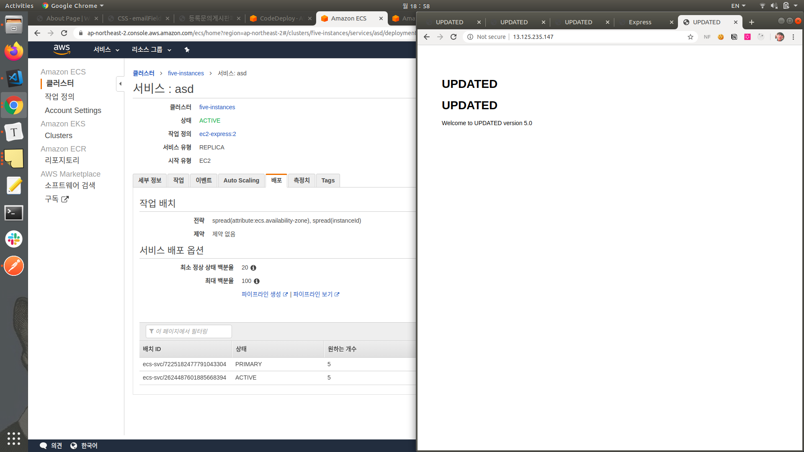
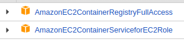
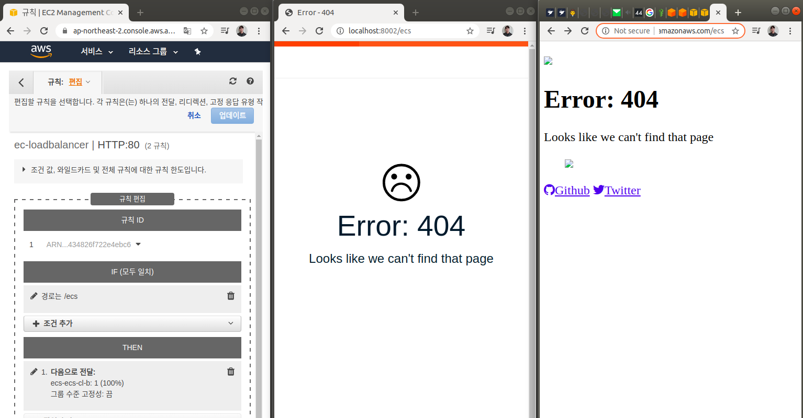

# 202002

#### 20200203

이번 방학동안 CodePipeline, ECS 와 씨름을 꽤 해온 것 같다. CodePipeline은 이제 실제 적용해서 쓰고 있을 정도로 익숙해졌고 편리하다. 하지만 ECS는 너무도 어려웠는데, 이제야 조금 감이 잡힌다.

ECS에 대한 개념이 잡힐 쯔음 이런 생각이 들었다. "ECS를 이용하면 정말 한 대(혹은 두 대)의 컴퓨터처럼 사용할 수 있겠구나."

여러 대의 컴퓨터를 **한 대 혹은 두 대**로 이용하기 위해서는 많은 개념이 필요하고, 이해하기 위해선 많은 흐름을 깨달아야했다. 그렇기에 초반에 러닝 커브가 심했던 것 같다.

* 서버에 대한 요청을 여러 컴퓨터로 뿌려주기 위해 로드밸런서가 필요하고, 
* 배포 중에서도 **무중단 배포** 방식을 이용하기 때문에, 라운드 로빈이나 블루그린이라는 배포 방식에 대한 이해도 필요하고,
* 업데이트시를 위해 클러스터의 성능을 계속 높여 놓는 것은 오히려 비효율적이므로 오토스케일링 기술도 필요하고, (라운드로빈은 컨테이너 개수를 줄일 수 있지만, 블루그린은 늘리는 방식인듯)
* 어떤 인스턴스에서도 동일하게 동작하는 배포를 하기 위해 컨테이너의 개념이 필요하고, 
* 그 컨테이너에 대해 이해하기 위해선 애초에 도커와 이미지에 대한 이해도 병행되어야한다.

어떻게 보면 클러스터링이 DevOps 포지션과 서버 설계에 있어 꽃이 아닐까 싶을 정도로 많은 내용이 뭉쳐져있다.

[ECS 배포 중 항상 등장했던 이슈들을 잘 정리해놓으신 글](https://afrobambacar.github.io/2018/10/ecs-blue-green-deployment.html)이 정말 많은 도움이 되었다.

위의 내용은 다소 느낀 점에 가깝고 오늘 배운 내용을 다시 정리해본다.

* ECS는 인스턴스들의 리소스가 합쳐진 성능을 갖기 때문에, 배포하려는 컨테이너들의 리소스와 클러스터의 리소스에 대한 이해가 필요하다.
  만약 RAM을 512MB 사용하는 컨테이너가 있다면, RAM이 1024MB인 인스턴스에는 약 2개의 컨테이너를 띄울 수 있다.
* 하지만 이런 식으로 한 인스턴스에서 여러 개의 컨테이너를 띄우려면 **동적 포트 매핑** 기술을 이용해야한다. 왜냐하면 한 인스턴스 내에 호스트의 같은 포트와 매핑되는 컨테이너는 여러 개 존재할 수 없기 때문.

우선 블루그린에 비해선 라운드로빈 방식이 쉬우므로 이것부터 정리해본다.

* 인스턴스 개수가 4개 CPU 1024MB, RAM 1MB (t2.micro의 사양)
* 컨테이너가 약 CPU 900MB, RAM MBGB (인스턴스의 리소스를 모두 쓸 수는 없음. 인스턴스 자체적으로 잡아먹는 리소스도 있으므로)
* 작업개수 2개, 미니멈 50%, 맥시멈 200% 의 업데이트를 통해 미니멈은 2 * 0.5=1개, 맥시멈은 2 * 2=4개로서 원래꺼 1개, 최신버전 4-1개가 공존하게 되고, 이 과정을 거치는 동안 로드밸런싱하기 떄문에 무중단 배포가 가능하다.

5개의 인스턴스, 인스턴스 하나당 컨테이너 한 개가 위치할 수 있음.

미니멈 20%, 맥시멈100%으로 업데이트 한 경우의 모습. 4개의 인스턴스가 업데이트 한 뒤, 원래 버전을 실행하던 한 개의 인스턴스도 새로운 버전으로 업데이트를 진행한다.



근데 블루그린은 A,B 서버로 로드밸런싱 후, 문제가 없다면 B 서버로 업데이트, 문제가 있다면 A서버로 롤백하는 점 이외에는 정확히 블루그린과 롤링업데이트의 차이가 무엇인지는 추후에 더 알아봐야겠다.


#### 20200204

PWA 에서 socketio를 통한 Notification 과 Push를 이용한 Notification을 어떻게 이용할까 고민했는데, window의 blur, focus 이벤트를 통해 App의 state에 유저가 화면을 뜨워놨는지, 숨겨놨는지에 대한 정보를 담을 수 있었다. 

* 창을 띄워놓은 경우는 숨겨놓은 경우-단순하게 socket.io를 통해 메시지 전달받음 
* 창을 띄워놓지 않았는데, 접속은 해있는 경우-socket.io를 통해 Notification 띄움
* 접속이 끊겨 있을 때-Push로 Notification을 띄움.

교내 동아리에서 알고리즘 스터디 자료를 보고 기초적인 자료구조를 복습했다. 소마를 지원하게 될 것 같은데, 알고리즘도 조금씩 공부해야할 것 같다.


#### 20200205

* firebase가 이용하는 service worker는 Notification(https://firebase.google.com/docs/reference/admin/node/admin.messaging.Notification?authuser=3&hl=ko) 과 일반적인 serviceWorker가 이용하는 showNotification, 두 개가 있더라. 

#### 20200210

요즘 학교 동아리 스터디로 알고리즘 푸는 중.

#### 파이썬에서 쓰이는 유용한 함수와 팁들

iterable 한 객체를 다루는 것들-map, enumerate, reduce, zip, sort, filter, items, keys, values, 

특수 알고리즘-combination, permutation

자료형-deque, queue, stack, list from for loop, mutiply list

리스트 요소-index, del, remove

```
#map, enumerate, reduce, zip, sort, filter, items, keys, values, 
#stack, list from for loop
l=[5,6,7,8,9]

from functools import reduce
print(reduce(lambda before, now: before+now, l , 0)) # 첫 항이 0,5
print(reduce(lambda before, now: before+now, l)) # 첫 항이 5, 6

for num in zip(l, ["a","b","c"]):print(num) # enumerate 처럼 사용

print(sorted(l, reverse=True))
print(list(filter(lambda n:n%2==0, l))) # true인 값만 반환

d={"a":"A", "b":"B", "c":"C"}
for k,v in d.items():print(k, v)

# a list like a stack
l.pop();l.pop();l.append(8);l.append(9)
print(l)
# 끼워넣고, 뺴고.
l.insert(3,100); l.pop(1)
print(l)

l=[5,6,7,8]
print([(num, index) for index, num in enumerate(l)])

from itertools import permutations, combinations, product
for p in permutations(l,3):
    print(p) 
for c in combinations(l,3):
    print(c)
#asterisk는 Unpacking
for p in product(*[[1,2,3],["a","b","c"]]):
    print(p)
```

del은 리스트의 인덱스나 딕셔너리의 키.

remove는 값


### 20200211

after 보다 최근인 documents

let after = await Message.find({ _id: { $gt: req.query.after } });

after 보다 오래된 documents

let after = await Message.find({ _id: { $lt: req.query.after } });

find로 얻은 document는 immutable하므로 프로퍼티를 추가하는 등의 변경하고 싶을 땐 Object.toObject()를 이용해야한다.


### 20200213

서버를 이전하면서 몇 가지 알게 된 사실이 있다.

1. docker 이용 시에 디스크에 볼륨이 부족하면 docker volume을 이용할 수 없다. (그냥 default하게 컨테이너가 실행되더라)
2. 리눅스 커널을 가끔 정리해줘야된다고 한다. (이 부분은 자세히는 모르지만, 은근히 공간을 차지하는 듯)
3. README에 서버를 돌리는 법을 잘 적어놓아야겠다. 이력서 쓰느라 repo 정리 겸 이번에 한 번에 다 README도 손보곤 했는데, 서버 이전할 때 많은 도움이 되더라.
4. 로그를 남기는 일은 정말 중요하다. (하지만 아직 미흡하다...)
5. **`CodePipeline`에 꼭 `CodeBuild`를 추가하지 않아도 된다.**
   전에 한 번 CodePipeline에 CodeDeploy만 넣어보려한 적이 있는데, 잘 동작하지 않았다. 아마 CodeBuild를 넣었다가 제거한 경우가 아니었을까싶다. CodePipeline에서 CodeDeploy의 입력을 소스 아티팩트와 빌드 아티팩트 둘 중 하나로 선택할 수 있는데, 이 때 **소스 아티팩트를 선택하면 CodeBuild 없이도 CodeDeploy로 배포**할 수 있다.
   어떻게 알게 되었냐면, CodeBuild에서 Repository를 받고 이후 .env를 추가한 뒤 아티팩트를 업로드했는데, 자꾸 CodePipeline에는 .env가 존재하지 않길래 자세히 보니, 이 때에는 입력이 빌드 아티팩트가 아닌 소스 아티팩트로 설정되어있었다. (즉 소스 아티팩트로 설정을 하면 빌드에서 뭘 결과물로 업로드하든 CodeDeploy는 Github repository내용을 그대로 받음) 이에 아이디어를 얻어 입력을 소스 아티팩트로 설정한 뒤 CodePipeline과 CodeDeploy를 설정하니 잘 배포되더라. 간단히 배포하고 싶을 때 사용하면 유용할 것 같다.

6. **CodeBuild에선 기본적으로 aws cli를 이용할 수 있고**, 이 때에는 IAM User로 aws configure을 해주는 것이 아니라 C**odeBuild에 부여된 IAM Role을 이용해서 명령을 수행**한다.
   위에서 말했던 CodeBuild에서 credentials를 담은 S3 Bucket내의 파일들을 다운로드 받는 작업을 추가했는데, 처음엔 403 혹은 404 에러가 났었다. CodeBuild의 IAM Role에 S3ReadOnly permisstion을 추가하니 잘 작동하더라. CodeBuild의 command 내에서 따로 aws configure을 할 필요는 없었고, 바로 `aws s3 copy s3://bucket-name/file-name .` 이런 식으로 이용이 가능했다.

### 20200217

morgan과 winston을 통해 로그 남기기

morgan은 http 접속에 대한 로그를 자세한 정도의 레벨에 따라 남겨주고

winston은 console.log 와 같은 작업을 레벨을 나눠 수행할 수 있도록 해준다.

예를 들어 `logger.info()`, `logger.debug()`와 같이 말이다.

winston은 winston을 통한 출력은 Console에 할 수도, File에 할 수도 있다. 이 때 winston과 morgan을 붙여서 morgan이 출력하는 log 또한 winston이 제공하는 stream으로 흘려보낼 수 있다. server 배포 시에 어떻게 로그를 남길 지 고민이었는데, winston과 morgan을 연결하면 편리할 것 같다.

### 20200218

#### docker-compose 를 이용한 완전한 개발 환경 구축

이번에 토이 프로젝트를 개발할 때는 docker-compose를 조금씩 사용하고있다. 사실 토이프로젝트를 배포할 때 docker-compose를 이용하면서 '_아 요거 신기하고 재미있긴한데, 솔직히 어디다 쓰지..? 지금은 배포 서버에서 docker-compsoe를 사용하는데 production 급이 되어서는 DB도 떼어내게 될텐데..Nginx는 서버 자체에 두고 있고... 정작 개발할 땐 그냥 로컬 개발 환경에서 진행하니까_...' 싶었다.

[도커 컴포즈를 활용하여 완벽한 개발 환경 구성하기](https://www.44bits.io/ko/post/almost-perfect-development-environment-with-docker-and-docker-compose)를 읽고... '그래.. 사실 docker-compose는 개발환경 구축에 좀 더 어울리는 것 같다.' 싶었다. 원래 그리 생각은 했지만, 내가 로컬에서 개발하고 실행할 때마다 다시 빌드하는 건 너무 비효율적일 것이라고만 생각했는데, 다시 생각해보니 volume으로 개발 중인 디렉토리만 달아주면 되긴한 것이었다.

진행 중이었던 토이 프로젝트에서 계속 react 디렉토리 가서 npm start 하고 express 디렉토리 가서 npm start 하기 귀찮았는데, docker-compose로 묶으니 생각보다 편했다.

그리고 bash shell 에서의 `alias`에 대해서도 알게 되었는데, 꽤나 많은 docker-compsoe.~~~.yml이 생겨나게 되어서 하나하나 타이핑하기 귀찮았는데, ~/.bashrc 에서 아래와 같은 방식으로 alias를 설정해주면  어디서든 `dc up`, `dc ps` 등으로 실행이 가능하더라!

```
# custom alias
alias dc="docker-compose -f $HOME/docker-compose.meet-local-dev.yml"
```

하지만 여전히 굳이 나 혼자 개발할 때 사용할 필요성까지는 못 느끼겠다. 하지만 내가 짠 코드로 여러 명(예를 들어 전체 팀원)이 개발 환경을 편리하게 구축할 수 있다면 정말 마법같은 일이 될 수 있을 것 같다.

_새로 입사했는데, local 개발환경 구축에 아래와 같은 두 줄만 필요하다고 생각해보면 놀랍긴 할 것 같다..._

```
$(aws ecr get-login --no-include-email)
docker-compose up
```


### 20200220

내 생각보다 요즘 알고리즘 풀이에  재미를 느낀다. 자료구조를 파악하고, 기본적인 풀이방식을 좀 배우고 푸니까 좀 더 풀만 한 것 같다. 전에는 맨땅에 헤딩식으로 풀다 보니 풀어도 뭔가 찝찝하고, 너무 오래걸리다보니 부담감도 있었는데, 요즘은 좀 더 가볍고 재미있게 접근할 수 있게된 것 같다.

DP는 원래 좀 풀었었고 받아들이는 데에 어려움은 없었고, 기본적인 큐, 스택 등의 자료구조 또한 어렵지 않았다.

다만 DFS와 BFS부분이 조금 추상적으로는 이해되지만 구현에서는 미스가 나는 경우가 많은 것 같아 천천히 다시 생각해봐야할 것 같다.


### 20200221

간간히 깔짝거리던 ECS의 흐름이 드디어 잡힌 것 같다.

1. cluster를 생성한다. 여기에 속하는 EC2 인스턴스는 컨테이너 인스턴스라고 부른다. 컨테이너가 아니다!
   그리고 cluster는 논리적인 단위이므로 빈 클러스터도 존재할 수 있다.

2. loadbalancer를 생성한다.

3. Task를 생성한다. 이때 Task는 약간 K8s의 Pod같은 느낌이다. 여러 개의 컨테이너를 정의할 수 있다. 따라서 한 Task에 존재하는 각 컨테이너의 수도 정해줄 수 있다.

   여기서 컨테이너에서 사용할 이미지를 설정해주는데, ECR의 이미지를 따로 인증없이 사용가능하다. 아마 ECS의 IAM Role에 ECR에 대한 접근권한이 있지 않을까 싶다.
   

   (사진은 자동으로 생성되는 ecsInstanceRole(EC2에 사용)의 Permission인데 역시 ECR에 대한 접근권한이 있었다.)

4. Task를 바탕으로 Service를 생성한다. Service에서도 숫자를 정할 수 있는데, 이건 사실 컨테이너의 숫자가 아니라 Task의 숫자이다.(이 부분이 조금 헷갈렸었음)
5. Service가 생성되면 ecs-agent가 cluster의 상태를 보고 가장 여유있는 컨테이너 인스턴스(EC2)에 작업을 Service의 Task를 잘 분배시킨다.

**주의사항**

ALB로 로드밸런서를 달 때 리스너 경로가 자동으로 `/servicename`이런 식으로 잡힐 때가 있는데, 경우에 따라 다르지만 `/`으로 설정해야 잘 작동하는 듯 하다. 아마 ALB에서 `loadbalancer.domain/servicename`으로 왔을 때 `container.domain/servicename`이런 식으로 proxy_pass하는 느낌인 것 같다.



위의 사진은 로드밸런서의 리스너를`/ecs`에 대해 나의 cluster의 대상그룹으로 요청을 넘기도록 설정했을 때이다. 갑자기 처음보는 error page가 뜨길래 로컬에서도 컨테이너를 실행해보았더니 원래 Image에 따라 설정된 에러페이지인듯하다. 

어쨌든 요점은 **로드밸런서의 리스너 경로를 자신의 경우에 맞게 잘 설정하자!**

다음은 `Ephemeral ports`에 관한 내용

[44bits ECS](https://www.44bits.io/ko/post/container-orchestration-101-with-docker-and-aws-elastic-container-service)평소에도 자주 챙겨보는 44bits의 글이 많이 도움이 되었는데, 만약 한 컨테이너 인스턴스에 여러 Task가 존재한다고 해보자. `80:80`으로 포트를 바인딩했는데, 컨테이너가 2개 이상이라면 80번 포트에 2개 이상의 프로세스가 묶이려는 행위이므로 불가능하다. 따라서 Task의 컨테이너 정의에서 host port를 0으로 설정해주면 `Ephemeral port`(32768~61000)사이의 포트로 자동으로 바인딩이 되고, 이를 편리하게도 ELB에서 자동으로 인식한다. 이를 **동적포트** 바인딩이라고 한다.

참 편리하지만, ec2 instance의 **security group에서 해당 ephemeral ports inbound를 허용**해주어야한다는 것을 명심해야한다! 그렇지 않으면 ELB의 healthcheck에서 unhealthy로 판정되어 loadbalancer의 target group에서 제명되고, 그렇게 되면 작업이 종료되고 다시 생성되는 것이 반복되더라.


### 20200224

어려운 문제들이라기 보단 참 쉽지만, 시간을 고려해봐야하는 문제들.

프로그래머스 `스택, 큐` 파트의 [주식문제](https://programmers.co.kr/learn/courses/30/lessons/42584?language=python3)를 풀던 중, 굳이 스택이나 힙을 이용해 풀 필요가 있을까 싶었다. 증가 중인지를 판별하는 작업의 시간 복잡도는 N을 길이라고 쳤을 때 O(N)이었고, 큐를 이용해서 증가 중인지 판별할 후보를 줄인다 해도 어차피 O(N) 이었기 때문에.

즉 무슨 말이냐면 `[[증가중인지에 대한 Flag, 값, 증가한 시간]]` 이러한 리스트를 이용해 각 리스트의 요소가 증가 중인지에 대한 Flag를 통해 증가 중인 요소에 대해서만 연산을 하겠다는 것이다.

이렇게 할 경우 중간에 요소를 제거하는 작업이 없으므로 매우 편리하다.

하지만 연산을 할 필요 없는 요소들까지 계속해서 증가중인지 판별해야하므로 시간적으로 비효율적이다.

따라서 덱에서(큐를 써도 무방하나, python 클래스 상 나는 deque 편하다.) 각 요소를 꺼낸 뒤 증가중인지 판별하고 증가중이지 않은 녀석은 답에 바로 집어넣어 버리는 것이다.

이 과정이 앞선 방법에 비해 조금 머리는 복잡한 이유는 

1. 보통의 경우 for문이 편리한데, for 문을 이용할 경우는 중간에 요소를 제거하는 것이 골치아파진다.
2. while문을 이용할 수 있겠지만, while문을 이용한다는 것 자체가 파이썬에선 for문 보다 복잡한 편
3. filter을 쓰면 필요 없는 요소는 걸러내고 필요있는 요소만 얻는 작업은 쉽지만, 걸러낸 필요 없는 요소를 이용한 연산은 진행할 수 없다.

이렇게 세 가지 이유를 들 수 있겠다. 아래는 해당 문제를 해결한 소스코드이다. 문제가 어려운 것은 아니지만, 쉬운 문제일 수록 시간에 예민한 편...

```

from collections import deque
def solution(prices):
    l=deque() # 값, 시간, 위치
    answers=[[]]*(len(prices)-1) # 마지막 요소는 어차피 0임.
    for i, price in enumerate(prices[:-1]):
        for _ in range(len(l)):
            obj=l.popleft()
            if(obj[0]<=price):obj[1]+=1;l.append(obj);
            else:answers[obj[2]]=obj[1]
        l.append([price, 1, i])
    for i in range(len(l)):
        obj=l.pop()
        answers[obj[2]]=obj[1]
    return answers+[0]
```


[완주하지못한 선수](https://programmers.co.kr/learn/courses/30/lessons/42576?language=python3)그냥 python의 filter나 in 을 이용해서 리스트로 풀면 한 줄이면 풀 수도 있지만(근데 동명이인때문에 좀 골치아파지긴함), 그렇게 풀 경우 시간이 초과되더라. 왜냐하면, 어떤 요소가 길이 N의 리스트에 속하는지 N번 확인해야하므로 O(N^2)의 시간복잡도를 갖기 때문.

딕셔너리를 이용한다면, key에 접근하는 시간 복잡도 혹은 키가 존재하는 지 확인하는 작업의 시간복잡도는 O(1)이므로 훨씬 빨라진다.

따라서 리스트에서 in을 쓰거나 두 리스트의 각각의 요소를 비교할 것이 아니라, 딕셔너리의 키를 이용하면 훨씬 빠르다. 아주 쉽지만, 쉬운 문제일 수록 이런 식으로 시간을 염두해야할 듯 하다.


### 20200225

AWS ELB와 AWS Certificate Manager, Route53을 이용해 SSL인증서를 이용한 HTTPS 서버 구축하기.

ELB를 생성한 뒤 그것의 DNS 이름을 보면 도메인 네임처럼 생긴 놈이 괄호치고 A Record라고 나와있다. 무슨 의미이냐면, 내가 생성한 ELB의 IP는 수시로 AWS 측에 의해 변경된다. 따라서 해당 도메인 네임은 일종의 실제 ELB의 IP에 대한 도메인 네임이자 Alias 같은 것이다.

만약 `umidev.net`의 도메인을 소유하고 있는 경우 `umidev.net`에 어떠한 목적지를 설정하기 위해선 A record만 설정가능한데, Route53을 이용하면 Alias를 이용해 ELB를 설정할 수 있다. 

* 즉 원래는도메인 네임을 묶으려면 CNAME으로 설정해야함
*  ELB의 도메인 네임은 말 그대로 도메인 네임이니까 CNAME으로 연결해줘야함.
  IP를 연결하자니 ELB의 IP는 계속 유동적으로 변경됨.
* 근데 국제정책(?)상 루트 도메인에 대해서는 ( `umidev.net` 같은 거. 앞에 `www.`나 `mail.`이런 게 안 붙은 ) A record만 설정 가능
* Route53을 이용하면 Alias를 통해 ELB의 A record를 자동으로 루트도메인에 연결가능.

ELB는 쉽게 말해 Nginx 나 Apache 같은 웹서버의 기능을 하기도 하고 추가적인 기능도 있기도 하다.

Target group에 목적지 EC2의 포트들을 설정하고, ELB 에 연결하면 된다. Certificate Manager에서 인증서를 받은 뒤 ELB에 연결할 수도 있다. 이 경우 HTTPS 통신이 가능하다. 80번 포트 (HTTP)에 대한 요청은 301 Redirect을 이용해 HTTPS 요청으로 넘길 수 있다.

원래 사용하던 도메인(예를 들면 `umidev.net`를 AWS 가 아닌 외부 호스팅 업체에서 구매한 도메인)이 있다고 해보자. 이 경우 원래는 Route53에서 설정이 불가능하니까 Alias를 쓸 수 없고, umidev.net 와 같은 루트 도메인에 ELB를 연결시킬 수 없다. 이 경우 Route53에서 루트 도메인과 동일한 이름의 hosted zone을 생성하고 그 네임서버를 복사해서 호스팅 업체의 네임서버 설정에 붙여넣으면 된다! 그럼 호스팅 업체의 네임서비스 설정란에서는 이제 설정할 수 없고 Route53에서는 설정이 가능하다.


### 20200227

#### docker swarm 과 ELB를 이용한 scaling 및 접속.

학교에서 Docker 와 Kubernetes를 배우던 시기 외에도 docker와 dokcer-compose 는 꾸준히 사용해왔지만, 사실 docker swarm을 쓸 일은 많지 않았다. 서버 한 대에서 포트 쪼개서 다양한 서비스를 제공하고 있는 판에 여러 서버를 돌일 일은 없었으니까.

하지만 ECS를 다루면서 container orchecstraion에도 다시금 흥미가 생겨 비교적 간단했던 docker swarm을 다루어보았다. 처음 접했을 때보다 내 능력치가 상승해서인지 막힘없이 한 번에 진행되어 조금 놀랐다... 역시 docker swarm... 간편한 작업을 할 땐 정말 편리하고 직관적이다.

#### 장점

- 간단한 orchestration 등의 작업들은 정말 쉽다.

#### 단점

- ECR을 이용할 경우 update가 번거롭다
  * 해결책 - ECR 이 아닌 docker hub의 priviate repo를 이용한다.
  * ECR proxy등의 이미지를 이용해서 docker login token을 계속 갱신해준다.

#### docker swarm 과 elb를 이용한 scaling 작업

1. EC2 instance를 여러 개 만든다. (나의 경우 세개) 그리고 docker를 설치 및 설정을 완료해준다.

2. 한 EC2 instance에서 docker swarm inist과 함께 advertise할 IP를 적어준다.

3. manager로든 worker로든 방금 클러스터에 참여한다.

4. manager 노드에서 아래와 같은 명령어로 서비스를 만든다.

   `docker service create --name ng -p 80:80 umi0410/nginx-host`

   (아직 서비스에 대해선 좀 더 정확한 이해가 필요하다.)

   호스트의 80번 포트에 컨테이너의 80번 포트를 바인딩하는데, 이 때 호스트의 80번 포트에 여러개의 컨테이너가 바인딩되면 자동적으로 로드밸런싱된다.

5. `docker service scale ng=10` 이런 식으로 scale out 해준다.

   그러면 node들의 상황에 맞게 적절하게 컨테이너가 분배된다.


이제 처음에 클러스터를 생성했던 EC2 Instacne의 Public IP로 접속해보자.


하지만, Hostname이 10개처럼 느껴지지 않을 것이다. 당연하다.... 아직 ELB를 붙이지 않았으니!

자기 자신 Instance내의 컨테이너끼리만 로드밸런싱이 된다. 따라서 전에 했듯이 ELB를 붙이고 Target group을 설정해주면 된다.


성공적으로 구축한 모습. 이번엔 ELB의 DNS로 요청을 보내야한다.

#### Container Instance(EC2)를 이용하는 ECS와 CodeDeploy를 연결

해봤지만, 아직 Auto scaling을 할 만한 부하를 주는 것도 쉽지 않았고, 내 레벨에선 실용성을 찾기 힘들었고, deploy 자동화까지만 다루어봄.

#### Fargate를 이용하는 ECS 이용

헐.... Fargate 신세계이다. 사실 Docker image를 이용한다는 것은 서버에서 건드릴 것 없이 독립적으로 운영될 수 있도록 한 것인데, 진짜 아무것도 설정할 것 없이 CPU와 RAM만 설정하면 된다. 

서버리스적이지만 Lambda와 비교했을 때 cold start가 없는 장점이 있고, Lambda를 자세히는 모르지만, Lambda를 처음 써봤을 때 함수를 작성하고 handler 작성하는 게 이해하기 어려웠는데, Fargate는 그냥 도커 이미지만 넘겨주면 돼서 아주 편리하다. 

그리고 EC2 와 비교했을 때는 Spot or Reserved Instance가 아니라면 Fargate와 비용이 거의 비슷한 반면, ECS 에서 EC2 는 t2.micro급 이상부터 사용가능한데, Fargate는 t2.nano보다도 작은 0.5 vCPU, 0.25GB RAM 까지 작게도 설정이 가능하다. tiny한 project에 적용하면 정말 좋을 듯~!

여태까지 써 본 AWS의 서비스 중 Fargate ECS가 제일 신세계였던 것 같다.

> _사실 EC2를 이용한 ECS 사용할 때 Auto scaling도 너무 어려웠고 부하 걸기가 쉽지 않았음 t2.micro급에게_
>
> 그리고 사실 다른 것들도 너무 신세계긴했다. ELB도 그랬고, S3 정적호스팅도 그렇고 CodePipeline도...ㅎㅎ..


