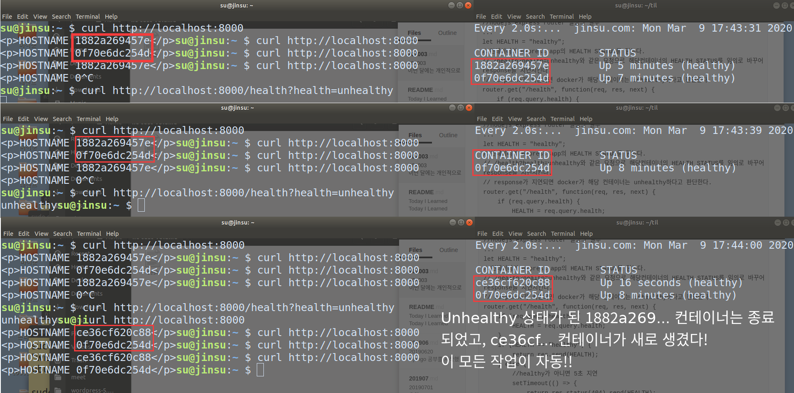
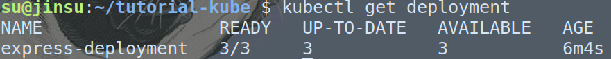
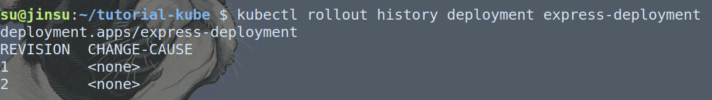
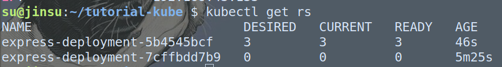
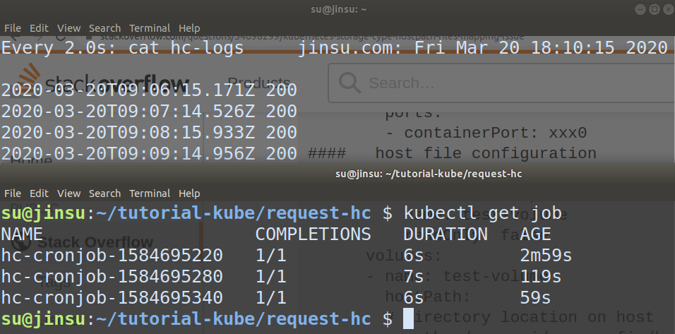
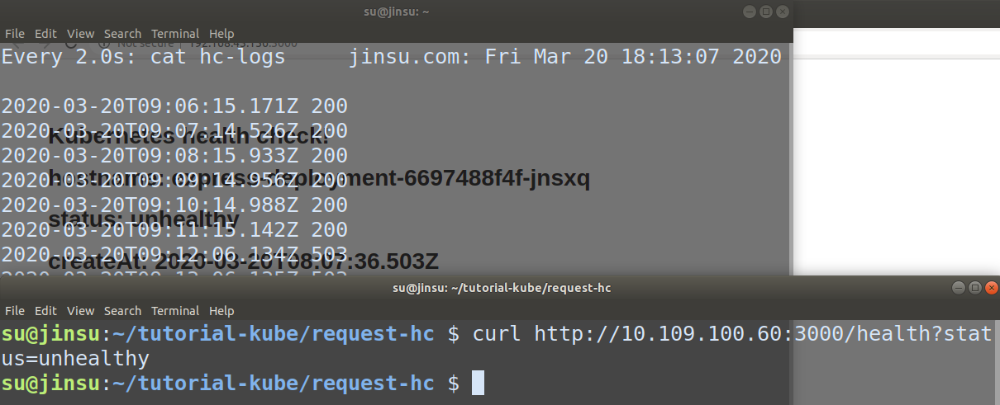
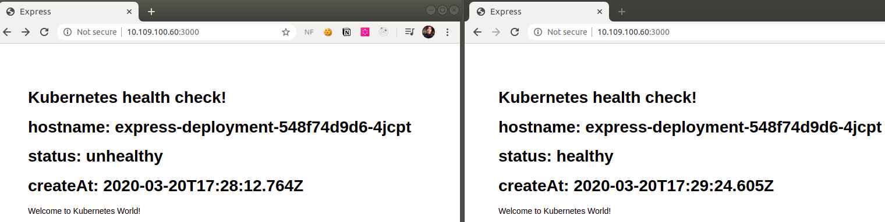
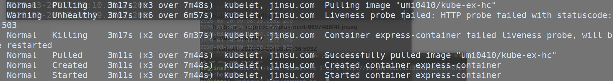

# 202003

이번 달에는 개인적으로 진행하던 프로젝트를 잠시 쉬고, Gitlab과 docker swarm, kubernetes를 잠깐 다뤄볼까한다.

시간이 된다면 django나 express를 좀 더 다뤄봐야겠다.

## 20200305

`GitLab` vs `Github` vs `Git`

이번에 지원한 모 기업에서는 특이하게도 코딩테스트로 알고리즘 문제가 아닌 `Django` API server 구축하기를 문제로 내주셨다. 이때 작업물을 `GitLab`의 repository로 제출하라고 안내해주셨는데, 평소에도 가끔 `GitLab`에 대해 들어보면서 어떤 서비스인지 궁금했었기에 이번에 한 번 알아보았다.

사실 `Github` vs `Git`은 Git을 처음 접하던 시기부터 익히접해왔었다. 쉽게 말하자면 Git은 버전 관리 시스템 자체, Github은 그러한 Git을 이용해 다양한 웹 서비스(Issue board나 REAME markdown 제공 등등)을 제공하는 대표적인 서비스인 것이다. 하지만 워낙에 Github이 대중적이고 요즘 Github Action도 꽤나 핫했기에 나는 무의식적으로 _'GitLab은 Github을 이용한 실험실인가...?'_라는 막연한 인상을 갖고있었다.

`GitLab`은 Github과 마찬가지로 Git의 주요기능인 Repository기능을 갖고 있으며 Issue를 남기거나 Pull Request 게시판 이용할 수 있다. Github과 다른 점은 

1. GitLab 자체에서도 `칸반보드`를 이용할 수 있다
2. `EKS` 와 연결할 수 있다. (`EKS` 외에도 `EC2`나 `Lambda`와도 연결 가능)
3. `CI/CD` 기능이 기본적으로 들어가있다.
4. 웹 IDE가 존재한다.
5. `Docker Hub`가 아니더라도 `ECR` 처럼 Private docker image repository를 제공한다.


간단히 요약하자면 `GitLab`은 Github과 서비스를 연동한다거나 Github에서 파생된 존재가 아닐뿐더러 Github이 약간 그저 Repository적 성향이 있었다면, GitLab은 `DevOps`들을 위한 기능들이 많이 추가되어있다고 볼 수 있겠다. 특히나 Docker와 K8s에 아주 친화적인듯하다.

나는 저번 2월달 혹은 1월달도 `AWS`의 `CodePipeline`,` CodeBuild`, `CodeDeploy`, `ECS ` 등을 다루면서 많은 시간을 보냈던 것 같다. 그 과정 속에서 내 이해력이나 지식이 늘어서인지는 모르겠지만, **`GitLab`의 배포 및 라인은 어떻게 돌아가는지 너무나도 알기쉬웠고, 직관적**으로 느껴졌다. 오늘 잠깐 맛을 본 게 전부인 정도이지만 직관적으로 잘 이해가 됐다.

어떤 차이가 있었는지 적어보자면

#### AWS CodePipeLine을 처음 이용했을 때

* CodeBuild는 뭐고 CodeDeploy는 뭐지? CodePipeLine은 뭐지? 아... CodeBuild랑 CodeDeploy도 뭔지 모르는데 어느 세월에 CodePipeLine에 엮기 까지 하지...?
* 왜 이렇게 IAM Role 설정할 게 많은 거야... 이 Role은 언제쓰는 거고 이 Role은 언제쓰는 거지?
* 아티팩트는 뭐고 언제 어디에 업로드 되는 거지?
* `codedeploy-agent`는 뭐하는 녀석이고 어떻게 깔고 실행하지?
* CodeBuild에서 CI서버에서 사용할 Image를 고르라면서 왜 꼴랑 2개밖에 없지?(Amazon Linux만 있었음)
* CodeDeploy에서는 환경변수가 왜 이리 안 먹지?

등등의 많은 궁금증과 의문, 난항이 있었다.


### GitLab을 처음 이용했을 때


* 음... `Kubernetes` 설정하는 칸이 있네 -> 아하 이건 의무는 아니고 EKS랑 연동할 수 있나보다. 아직 EKS 다룰 줄 모르니까 EKS를 다뤄보게되면 사용해봐야겠다.
* CI/CD configuration - 아 이곳에서 CI/CD관련 설정을 하나보다. - 그 설정이 너무나도 간단하고 직관적이다.
* Build 하거나 Deploy될 컴퓨터를 `Runner` 라고 부른다. - `codedeploy-agent` 처럼 `gitlab-runner`라는 것이 필요하구나. -> 설치법이 너무 간단하고 docker 로 실행할 수도 있다.

사실 처음보는 EKS를 설정하면서 삽질을 좀 하긴 했는데, k8s도 제대로 못 다루는 상황에서 EKS를 써보는 건 너무 앞서나가는 것 같아 후퇴했고, 그 뒤로는 전혀 막힐 부분이 없었다...

`GitLab`에 대해 좀 더 알게되면 `til`에서 간단히 다루는 것 외에 동아리에서 간단한 발표나 블로그에 포스팅하는 시간을 가져보는 것도 나쁘진 않을 것 같다.

개인적으로 `AWS` 의 큰 팬심이 있지만, `GitLab` 또한 너무 직관적이고 쉬운 사용법에 매력을 느껴버렸다.

다만 단점이라고 한다면, 쉬운 사용이 가능한 만큼 디테일한 설정이나 AWS 와 연동한 다양한 설정은 불가능할 것이라는 점! 예를 들면 EKS와는 연동이 되는 듯 하지만, ECS와는 연동이 안된다거나하는 점이 있을 것 같다.


## 20200306

### CI/CD Pipeline에서 script error 및 exit code 무시하기

[작성한 Stackoverflow 글](https://stackoverflow.com/questions/60559436/how-can-i-redirect-std-error-to-std-out-in-gitlab-runner)


GitLab CI/CD pipeline 구축 도중 사진과 같은 사소한 error로 인해 pipeline이 중단되고 말았다. AWS CodeDeploy를 이용할 때에도 이런 현상을 자주 겪었고, 그 해결 방안으로 error redirect를 이용했다. (std error을 std out으로 redirect함으로써 error 발생을 무시하는 방식)

하지만 GitLab을 이용하면서는 redirect가 성공적으로 이루어져도 pipeline이 중단되었다. 이유가 무엇일까싶어, 해결방안은 무엇일까 싶어 Stackoverflow에 글을 올려보았고, 좋은 답변을 얻었다.

적절히 나의 해석과 변역을 적어보자면,

linux나 unix system에서 모든 command는 숫자로 된 exit code를 가지고, 흔히 c나 c++에서 다뤄보았는 `exit 0`(즉 exit code가 0)은 성공을 의미하고 exit code가 0이 아니라면 실패로 여긴다. GitLab CI는 std error가 아닌 exit code를 통해 error detecting을 하는 방식이었고 따라서 `docker stop ng` 라는 커맨드의 exit code를 항상 0으로 만들어주면 된다.

`docker stop ng || true` - ||는 일반 프로그래밍언어에서와 같이 앞의 결과가 0이면 뒤도 실행, 앞의 결과가 0이 아니면 뒤는 실행 안함.

- docker stop ng가 에러를 일으키면 exit code가 1이 아니다. 따라서 뒤를 실행-> true의 exit code는 성공을 의미하는 0 -> 결과는 성공을 의미하는 0
- docker stop ng가 에러를 일으키지 않는다. ->앞에만 실행해서 exit code는 0 -> 성공을 의미


## 20200307

### Docker machine

docker를 처음 알게되었을 때 docker machine을 사용해보곤했는데, 요즘 `docker swarm`을 사용하면서 ec2 instance를 t2.micro는 free tier 가 다 차버려서 그냥 t2.nano로 생성하고 도커를 깔고 껐다 켰다 하면서 사용하곤 했는데, 생각해보니 그냥 docker machine을 이용하면 더 편하게 docker swarm이나 kubernetes를 이용해볼 수 있지않을까싶어 docker machine에 대해 간단히 알아보았으나, 생각보다 그 쓰임이 많진 않고, AWS 와의 연동성도 약해보여 그닥 사용할 일은 없을 듯하다. (EC2 에서는 아마 virtualbox를 이용할 수 없고, docker machine 에서 driver을 amazon ec2로 설정해서 EC2 instance를 docker machine으로서 생성시킬 순 있지만, 사실 docker machine을 이용해서 instance를 생성할 일은 없을 듯하다)

docker machine은 docker에 기본적으로 내장된 프로그램은 아니고, Github 저장소를 이용해 설치할 수 있다. [docker docs 참고](https://docs.docker.com/machine/install-machine/) 에 나와있듯이 Github의 release 를 이용해 다운로드 받을 수 있고, 설치가 정말 쉽다.

docker machine을 통해 machine (docker가 사용가능한 가상 머신 혹은 public cloud의 instance)을 만들 때에는 `driver`라는 개념이 존재한다. 개인적인 해석에서의 `driver`란 어떤 방식을 이용해 machine을 만들 것인가이다. 주로 `virtualbox`를 이용했었고, 이번에 알게되었는데, 흥미롭게 `amazonec2` 를 이용해서도 docker machine을 만들 수 있더라.

docker machine에 대해 알아보다가 `docker daemon`에 대해 좀 더 깊게 생각해볼 기회를 갖게 되었고 이를 바탕으로 **블로그에 [docker daemon 설정을 이용해 원격으로 docker 이용하기](https://senticoding.tistory.com/94)**를 작성하였다.

## 20200308

어제 docker daemon에 추가설정을 해줌으로써 client가 원격으로 docker을 이용하는 내용을 다뤄보았는데, 이에 추가적으로 docker가 REST API를 이용한다는 것을 log를 통해 눈으로 확인하고, 외부에서도 REST API로 docker을 원격으로 이용해보는 내용을 다루어보았다.

블로그 - [Docker가 REST API를 이용함을 확인해보자](https://senticoding.tistory.com/95)


## 20200309

### Docker container의 healthcheck 하기

다양한 도커 실행환경에서의 [health check에 대한 좋은 글](https://codeblog.dotsandbrackets.com/docker-health-check/)을 읽어보았다.


health check 옵션을 넣어주면 STATUS에 평소엔 없던 health status도 나오게 된다.

이를 통해 docker swarm 으로도 unhealthy한 container는 죽이고 replica수를 유지하기 위해 다시 컨테이너를 만들고 실행시키는 작업을 해볼 것이다.

```
//nodejs express router 설정의 일부
...
let HEALTH = "healthy";
//컨테이너의 express app의 HEALTH STATUS를 담는다.
// /health?health=unhealthy와 같은 요청으로 해당컨테이너의 HEALTH STATUS를 임의로 바꾸어 response를 지연시킨다.
// response가 지연되면 docker가 해당 컨테이너는 unhealthy하다고 판단한다.
router.get("/health", function(req, res, next) {
	if (req.query.health) {
		HEALTH = req.query.health;
	}
	if (HEALTH == "healthy") {
		return res.send(HEALTH);
	} else {
		//healthy가 아니면 5초 지연
		setTimeout(() => {
			return res.status(404).send(HEALTH);
		}, 5000);
	}
});
...
```

```
# Dockerfile
HEALTHCHECK --interval=5s --timeout=3s --retries=1 CMD curl -sS http://localhost:3000/health || exit 1
```

에러가 있으면 exit code를 1로 지정된 뒤 unhealthy, 에러가 없어도 timeout보다 오래걸리면 unhealthy가 됨. (retries 에 따라 경우는 조금씩 다름)

timeout의 경우 unhealthy시의 express에서 delay를 2.5초로 잡으면 timeout으로 설정한 3초보단 짧으니 계속해서 healthy, express에서 dealy를 5초로 잡으면  unhealthy가 된다.

그럼 이를 docker swarm에서 이용해보겠다.

docker swarm을 쓸 때에는 웬만해선 cli에서 바로 service를 만드는 것 보단 docker-compose와 docker stack 을 이용해 안정적으로 service를 만드는 것이 좋아보인다.

replica 수를 2개로 늘려서 진행해보았다.



두 개의 컨테이너 중 하나를 unhealthy하게 만들자, 해당 컨테이너는 자동으로 종료되었고 새로운 컨테이너가 생성되었다. 너무 재미있다 >_< 이 작업을 실제 구동중이던 토이프로젝트 서버에 적용시키고, health check이 fail되면 slack으로 알림을 보내주는 것도 좋을듯!

다음에 기회가 된다면 docker stack과 docker task에 대해 조금 읽을거리를 읽어보는 시간을 가져야겠다.

### docker swarm을 이용해 컨테이너 health check, 무중단 배포하기

과거에 진행 입맛 프로젝트의 서버를 docker swarm을 이용해 단일 호스트-단일  컨테이너가 아닌 단일호스트-복수 컨테이너의 형태로 구성하였다. 이유는 docker swarm이 제공하는 health check을 통한 replica 수 유지 기능과 무중단 배포를 사용해보려고!

service를 생성할 때 host의 port에 binding할 port를 적어주면 컨테이너의 포트가 동적으로 host port에 바인딩된다. 80:8000으로 바인딩 시키면 각 컨테이너의 8000번 포트가 호스트의 80번으로 바인딩되는데. 이 때 자동으로 로드밸런싱 되는 것이다.

가끔 불안한 마음에 직접 health check을 하곤 했는데, 이젠 swarm이 자동으로 서버의 안전을 케어해줄 뿐만아니라 혹시라도 컨테이너를 재생성하게 되면 slack bot이 알림을 준다!

무중단배포는 사실 사용자가 많지 않아 필요한 작업은 아니었지만, 경험해보고싶었다.


## 20200310

### Advantages of running multiple containers

> 다수의 컨테이너를 실행하는 경우(특히 노드에 비해 많은 컨테이너나 한 노드에 다수의 컨테이너를 이용하는 경우)의 장점이 무엇일까? 항상 고민이었다! docker swarm과 K8s를 접한 뒤로 컨테이너:노드의 비는 어떠한 게 좋은가, 다수의 컨테이너를 이용할 떄의 장점이 무엇일까.
> 항상 주변분들에게도 많이 자문을 구하고 했지만, 요즘 docker swarm을 다루고 k8s에 대해 알아보면서 조금 감을 잡을 수 있었던 것 같고 무엇보다 뭐라고 검색해야할지 잘 모르겠었는데, 저 위에 적은 한 줄이 많은 내용을 가져다주었다.

[[k8s] What is the benefit of running multiple containers of the same image on a single node?](https://www.reddit.com/r/devops/comments/afd1a9/k8s_what_is_the_benefit_of_running_multiple/) 요약

> 재미있는 건 저 질문을 던진 글쓴이가 정말 나와 같은 생각을 하고있었다는 것이다. 무엇보다 "리소스를 제한하지 않은 선에서 한 노드에 여러 컨테이너를 둘 때는 뭐가 좋냐"는 질문이 내 생각과 너무 맞아떨어졌다.

한 노드에서 다수의 컨테이너를 운영할 때의 장점이 무엇이냐는 것이다.

* downtime이 없는 업그레이드
* resiliency(복원력). 어떤 컨테이너가 memory leak 혹은 에러로 인해 unhealthy한 상태가 되어도 서비스를 진행하는 데에 문제 없으면서도 그 컨테이너를 삭제하고 새 컨테이너를 만드는 행위가 가능.
* 보통은 하나의 프로세스가 하나의 코어만을 이용할 수 있는데, 여러 컨테이너를 돌리면 많은 코어를 이용할 수 있다(?)-이 내용은 잘 이해되지않는다. 아직 코어에 대한 내용이 부족해서..
  -> 서버의 자원을 최대한 이용할 수 있다.

## 도커와 컨테이너 오케스트레이션을 쓰면 좋은 이유

개인적으로는 도커를 이용했을 때의 장점을 생각해볼 때 사실 팀원들이 각자 도커 커맨드 한 줄로 공통된 개발환경을 구축할 수 있다거나, python 2.x를 사용한다거나 python 3.x를 사용한다거나 할 때 버전이 꼬이는 것을 막아준다거나 이런 것에 중점을 두지 않는다.

virtual env를 이용하는 방법, nvm을 이용하는 방법으로 다양하게 가상으로 버전관리를 하는 방법도 많고, 실제로 그렇게 버전을 왔다갔다하면서 개발을 하는 사람이 있을까 싶다. 그렇게 버전에 디펜던시가 강하고 관리에 손이 많이 가야하는 프로젝트 자체가 건강하지 않은 프로젝트가 아닐까 싶다. 따라서 나는 굳이 도커의 장점을 이러한 곳에서 찾지 않는다.

* 언제 보아도 이해할 수 있도록 코드로 그 기록이 남는다.

  - 문서화를 철저하게 하고 주석을 잘 다는 것은 좋겠지만, 그로 인한 코스트도 분명 존재할 것이고, 급하게 개발할 수록 그런 부분에 신경을 못 쓰는 경우가 많다. 몇 개월이 지난 후 갑자기 서버가 죽었다거나, 프로그램이 정상 동작을 안할 때 다시 서버를 구동시키려는데 무슨 설정을 했는지 기억이 안난다거나 하는 등의 일이 벌어질 수 있는데, 만약 남겨놓은 문서가 구버전이라면 어떡할까?

    도커를 이용하면 해당 서버에 대한 기록이 모두 이미지를 만들 때 이용했던 Dockerfile 혹은 service를 생성할 때 이용한 docker-compose.yml에 남게 되므로 언제보아도 코드를 통해 작업을 명확히 알 수 있다.

* Cloud vendor에 대한 의존성을 낮춰줄 수 있다.

  * 이 부분은 워낙에 내가 AWS 팬이기 때문에 잘 와닿지는 않지만, 다른 클라우드로 서비스를 이전한다거나 할 때 Docker를 지원하는 cloud service라면 문제없이 이전할 수 있다는 장점이 있을 것 같다.

* 프로그램의 안정성을 높여주고, scale하기 쉽다, 무중단배포가 쉽다.

  * 독립된 실행환경 구축과 함께 많이 등장하는 얘기인데, 개인적으론 이 내용이 가장 장점이 아닐까싶다. health check후 상태가 좋지 않은 컨테이너는 자동으로 삭제시키고 새로운 컨테이너를 만들어 서비스의 건강 상태를 유지한다거나, 한 줄의 커맨드만으로 scale in/out을 할 수 있다는 점은 직접 경험해보면 굉장히 놀랍다.
  * 또한 docker swarm이나 k8s를 이용하면 손쉽게 자동으로 무중단배포를 할 수 있는데, 이게 장점이라고 느껴지지 않는다면, 직접 무중단 배포를 구축해보면 깨달을 수 있지 않을까싶다...

* 신기하고 재미있다.

  * \>_<

* 서버를 깨끗하게 유지할 수 있다.
  * 이건 정말 나의 주관적인 생각일 수도 있는데, 개인적으로 몇 가지 토이프로젝트를 진행하면서, 서비스 규모가 작다보니 프로젝트별로 인스턴스를 두는 게 아니라, 한 인스턴스 내에서 포트만 다르게 이용하면서 프로젝트를 실행하곤 했는데, 보통 이런 과정을 겪으면 점점 서버가 더러워지더라. 이런 저런 파일이 쌓이고, 이 파일이 왜 존재하는 지 까먹고 하다보면 함부로 서버를 건들지 못하는 두려움이 생긴다.
    하지만 docker을 이용하면 docker ps로 모든 서버의 프로세스를 관리할 수 있고, 혹시 프로세스를 실수로 종료하였다 하더라도 이미지는 그대로 존재하니, 손쉽게 다시 서버를 띄울 수 있어서 좋았다.

## 20200315

화이트데이를 맞이해 나는 돈 쓸 일이 없으므로 쿠버네티스 강의를 구매했다 ㅎㅎ...

영어로 된 강의 외에 한국 강의는 처음 유료로 구매하게 되었는데, 쿠버네티스를 공부하면서 모르는 내용을 검색했더니 같은 강의의 Q&A 게시판으로 가게되길래, 꽤 좋은 내용을 다루고 신경써주시는 것 같아 구매해봤다. 당분간 이 강의를 통해 조금 체계적으로 공부해볼 수 있을 듯.

## 20200316~20200319

주로 구매한 인강을 통해 쿠버네티스의 개념을 다시 잡아가고있다. minikube를 이용하지 않고 EC2와 laptop에서 cluster 환경을 구축해보았다.

주로 cluster 환경을 구축하는 것에 많은 시간이 드는 것 같고, 간단하게 Pod를 배포하거나 업데이트하고 volume을 입히는 것은 그리 어렵지 않은 듯하다. 아무래도 어떤 식으로 배포가 되고 어떤 방식으로 돌아가는지는 ECS, CodePipeline, docker swarm 등에서도 어느정도 다뤄봐서그런지 대체로 흐름을 잡는 것은 어렵지 않았다. 하지만 '실제로 K8s를 어떻게 쓸 지'의 시선으로 넘어가면, 아직 다양한 설정과 옵션들을 모르기에 좀 더 자세히 알아봐야할 듯!

ConfigMap과 Secret을 통해 Pod에 데이터를 전달하는 것을 알아보았다.

K8s를 처음 알아갈 때, Deployment 과 ReplicaSet이 좀 헷갈렸고, 그냥 ReplicaSet을 직접 사용하는 경우는 드물고, Deployment를 사용하는 것이 좋다고만 들어서 Deployment만 사용해왔는데, 이제 두 Controller의 관계를 알게된 것 같다.

**Deployment는 ReplicaSet을 이용해 Pod들을 관리**한다고 할 수 있다. 즉 Deploymet가 직접 pod를 관리한다기보단, pod를 관리할 ReplicaSet을 관리한다고 볼 수 있다.







사진과 같이 Deployment를 업데이트 할 때 필요에 따라 새로운 replicaset을 만들고, 기본적으로 원래 있던 replicaset은 사라지지 않는다. 이후 rollback을 한다면 과거에 이용하고 남아있던 replicaset을 다시 이용할 수 있다. Deployment 자체가 Pod를 직접 관리하는 것이 아니라는 의미이다.


## 20200320

k8s의 cron job 기능과 LivenessProbe 기능을 이용해 Pod의 HealthCheck을 하는 내용을 다뤄보겠다.

### express pod

* `/` - 현재 Pod의 상태를 나타내는 Endpoint

  hostname, health, 생성 시기를 보여줌.

* `/health?status=` - Pod의 health를 제어하는 Endpoint 

  query가 없으면 그냥 health status에 따라 response

### cron job pod

* 10초마다 `/`으로 HTTP GET request

* 로그를 통해 어떻게 되는 지 알아보기

  로그를 어떻게 남길 수 있을까? => 우선은 hostPath volume을 이용했다.

### LivenessProbe

* 10초마다 `/`으로 HTTP GET request

* 2번이상 unhealthy하다고 판정=>Pod 새로 생성

  Pod가 새로 생성되면 hostname과 생성시기가 바뀔 것임.


### Cronjob 수행결과



주의할 점은 cron job에서도 latest 이미지를 사용하고, docker build 로도 latest image 를 새로 만들게 되면, cronjob 이 자동으로 image를 pull해오기때문에, 자꾸만 push되어있는 latest 이미지로 변경될 수가 있더라!



health status를 바꾼뒤엔 503 코드가 뜨는 모습.

마찬가지 방법으로 cronjob을 통해 lambda나 heroku서버에게 주기적으로 요청을 보내서 서버가 동면상태에 빠지지 않게 할 수도 있겠다.



<좌측은 unhealthy한 Pod, 우측은 livenessProbe를 통해 restart된 Pod의 모습>

livenessProbe에 의해 healthCheck이 되면서 Pod를 restart 시키는 모습이다. delete and create이 아닌 restart 되었으므로 pod의 hostname은 동일하다.



`kubectl describe pod` 를 통해 pod가 restart되었음을 확인할 수 있다. container는 삭제 후 생성되고 시작된다.

