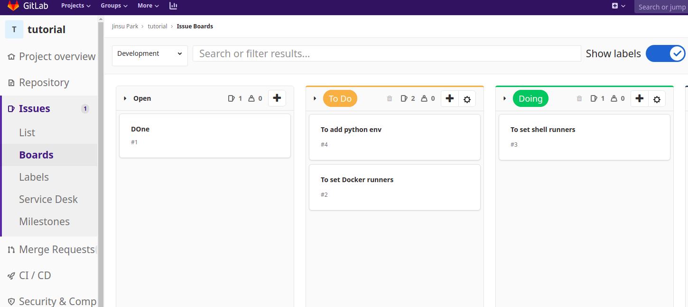
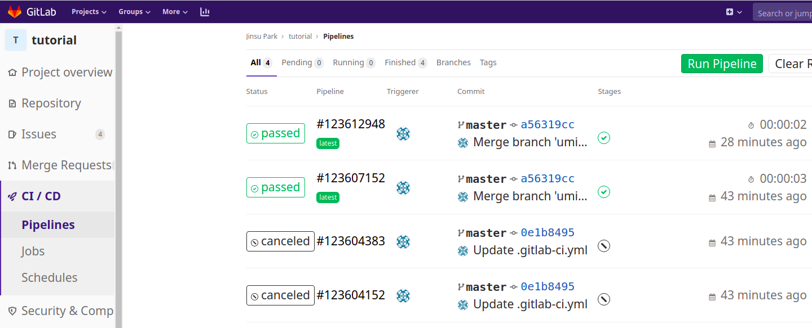
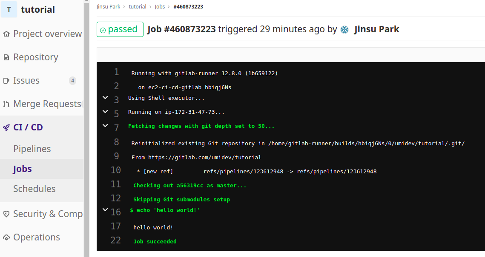
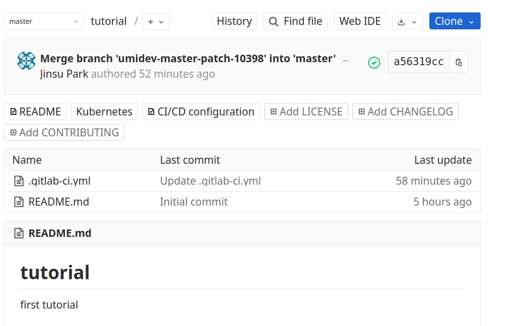

# 202003

이번 달에는 개인적으로 진행하던 프로젝트를 잠시 쉬고, Gitlab과 docker swarm, kubernetes를 잠깐 다뤄볼까한다.

시간이 된다면 django나 express를 좀 더 다뤄봐야겠다.

## 20200305

`GitLab` vs `Github` vs `Git`

이번에 지원한 모 기업에서는 특이하게도 코딩테스트로 알고리즘 문제가 아닌 `Django` API server 구축하기를 문제로 내주셨다. 이때 작업물을 `GitLab`의 repository로 제출하라고 안내해주셨는데, 평소에도 가끔 `GitLab`에 대해 들어보면서 어떤 서비스인지 궁금했었기에 이번에 한 번 알아보았다.

사실 `Github` vs `Git`은 Git을 처음 접하던 시기부터 익히접해왔었다. 쉽게 말하자면 Git은 버전 관리 시스템 자체, Github은 그러한 Git을 이용해 다양한 웹 서비스(Issue board나 REAME markdown 제공 등등)을 제공하는 대표적인 서비스인 것이다. 하지만 워낙에 Github이 대중적이고 요즘 Github Action도 꽤나 핫했기에 나는 무의식적으로 _'GitLab은 Github을 이용한 실험실인가...?'_라는 막연한 인상을 갖고있었다.

`GitLab`은 Github과 마찬가지로 Git의 주요기능인 Repository기능을 갖고 있으며 Issue를 남기거나 Pull Request 게시판 이용할 수 있다. Github과 다른 점은 

1. GitLab 자체에서도 `칸반보드`를 이용할 수 있다
2. `EKS` 와 연결할 수 있다. (`EKS` 외에도 `EC2`나 `Lambda`와도 연결 가능)
3. `CI/CD` 기능이 기본적으로 들어가있다.
4. 웹 IDE가 존재한다.
5. `Docker Hub`가 아니더라도 `ECR` 처럼 Private docker image repository를 제공한다.

간단히 요약하자면 `GitLab`은 Github과 서비스를 연동한다거나 Github에서 파생된 존재가 아닐뿐더러 Github이 약간 그저 Repository적 성향이 있었다면, GitLab은 `DevOps`들을 위한 기능들이 많이 추가되어있다고 볼 수 있겠다. 특히나 Docker와 K8s에 아주 친화적인듯하다.

나는 저번 2월달 혹은 1월달도 `AWS`의 `CodePipeline`,` CodeBuild`, `CodeDeploy`, `ECS ` 등을 다루면서 많은 시간을 보냈던 것 같다. 그 과정 속에서 내 이해력이나 지식이 늘어서인지는 모르겠지만, **`GitLab`의 배포 및 라인은 어떻게 돌아가는지 너무나도 알기쉬웠고, 직관적**으로 느껴졌다. 오늘 잠깐 맛을 본 게 전부인 정도이지만 직관적으로 잘 이해가 됐다.

어떤 차이가 있었는지 적어보자면

#### AWS CodePipeLine을 처음 이용했을 때

* CodeBuild는 뭐고 CodeDeploy는 뭐지? CodePipeLine은 뭐지? 아... CodeBuild랑 CodeDeploy도 뭔지 모르는데 어느 세월에 CodePipeLine에 엮기 까지 하지...?
* 왜 이렇게 IAM Role 설정할 게 많은 거야... 이 Role은 언제쓰는 거고 이 Role은 언제쓰는 거지?
* 아티팩트는 뭐고 언제 어디에 업로드 되는 거지?
* `codedeploy-agent`는 뭐하는 녀석이고 어떻게 깔고 실행하지?
* CodeBuild에서 CI서버에서 사용할 Image를 고르라면서 왜 꼴랑 2개밖에 없지?(Amazon Linux만 있었음)
* CodeDeploy에서는 환경변수가 왜 이리 안 먹지?

등등의 많은 궁금증과 의문, 난항이 있었다.

### GitLab을 처음 이용했을 때

* 음... `Kubernetes` 설정하는 칸이 있네 -> 아하 이건 의무는 아니고 EKS랑 연동할 수 있나보다. 아직 EKS 다룰 줄 모르니까 EKS를 다뤄보게되면 사용해봐야겠다.
* CI/CD configuration - 아 이곳에서 CI/CD관련 설정을 하나보다. - 그 설정이 너무나도 간단하고 직관적이다.
* Build 하거나 Deploy될 컴퓨터를 `Runner` 라고 부른다. - `codedeploy-agent` 처럼 `gitlab-runner`라는 것이 필요하구나. -> 설치법이 너무 간단하고 docker 로 실행할 수도 있다.

사실 처음보는 EKS를 설정하면서 삽질을 좀 하긴 했는데, k8s도 제대로 못 다루는 상황에서 EKS를 써보는 건 너무 앞서나가는 것 같아 후퇴했고, 그 뒤로는 전혀 막힐 부분이 없었다...

`GitLab`에 대해 좀 더 알게되면 `til`에서 간단히 다루는 것 외에 동아리에서 간단한 발표나 블로그에 포스팅하는 시간을 가져보는 것도 나쁘진 않을 것 같다.

개인적으로 `AWS` 의 큰 팬심이 있지만, `GitLab` 또한 너무 직관적이고 쉬운 사용법에 매력을 느껴버렸다.

다만 단점이라고 한다면, 쉬운 사용이 가능한 만큼 디테일한 설정이나 AWS 와 연동한 다양한 설정은 불가능할 것이라는 점! 예를 들면 EKS와는 연동이 되는 듯 하지만, ECS와는 연동이 안된다거나하는 점이 있을 것 같다.

## 20200306

### CI/CD Pipeline에서 script error 및 exit code 무시하기

[작성한 Stackoverflow 글](https://stackoverflow.com/questions/60559436/how-can-i-redirect-std-error-to-std-out-in-gitlab-runner)

GitLab CI/CD pipeline 구축 도중 사진과 같은 사소한 error로 인해 pipeline이 중단되고 말았다. AWS CodeDeploy를 이용할 때에도 이런 현상을 자주 겪었고, 그 해결 방안으로 error redirect를 이용했다. (std error을 std out으로 redirect함으로써 error 발생을 무시하는 방식)

하지만 GitLab을 이용하면서는 redirect가 성공적으로 이루어져도 pipeline이 중단되었다. 이유가 무엇일까싶어, 해결방안은 무엇일까 싶어 Stackoverflow에 글을 올려보았고, 좋은 답변을 얻었다.

적절히 나의 해석과 변역을 적어보자면,

linux나 unix system에서 모든 command는 숫자로 된 exit code를 가지고, 흔히 c나 c++에서 다뤄보았는 `exit 0`(즉 exit code가 0)은 성공을 의미하고 exit code가 0이 아니라면 실패로 여긴다. GitLab CI는 std error가 아닌 exit code를 통해 error detecting을 하는 방식이었고 따라서 `docker stop ng` 라는 커맨드의 exit code를 항상 0으로 만들어주면 된다.

`docker stop ng || true` - ||는 일반 프로그래밍언어에서와 같이 앞의 결과가 0이면 뒤도 실행, 앞의 결과가 0이 아니면 뒤는 실행 안함.

- docker stop ng가 에러를 일으키면 exit code가 1이 아니다. 따라서 뒤를 실행-> true의 exit code는 성공을 의미하는 0 -> 결과는 성공을 의미하는 0
- docker stop ng가 에러를 일으키지 않는다. ->앞에만 실행해서 exit code는 0 -> 성공을 의미

## 20200307

### Docker machine

docker를 처음 알게되었을 때 docker machine을 사용해보곤했는데, 요즘 `docker swarm`을 사용하면서 ec2 instance를 t2.micro는 free tier 가 다 차버려서 그냥 t2.nano로 생성하고 도커를 깔고 껐다 켰다 하면서 사용하곤 했는데, 생각해보니 그냥 docker machine을 이용하면 더 편하게 docker swarm이나 kubernetes를 이용해볼 수 있지않을까싶어 docker machine에 대해 간단히 알아보았으나, 생각보다 그 쓰임이 많진 않고, AWS 와의 연동성도 약해보여 그닥 사용할 일은 없을 듯하다. (EC2 에서는 아마 virtualbox를 이용할 수 없고, docker machine 에서 driver을 amazon ec2로 설정해서 EC2 instance를 docker machine으로서 생성시킬 순 있지만, 사실 docker machine을 이용해서 instance를 생성할 일은 없을 듯하다)

docker machine은 docker에 기본적으로 내장된 프로그램은 아니고, Github 저장소를 이용해 설치할 수 있다. [docker docs 참고](https://docs.docker.com/machine/install-machine/) 에 나와있듯이 Github의 release 를 이용해 다운로드 받을 수 있고, 설치가 정말 쉽다.

docker machine을 통해 machine (docker가 사용가능한 가상 머신 혹은 public cloud의 instance)을 만들 때에는 `driver`라는 개념이 존재한다. 개인적인 해석에서의 `driver`란 어떤 방식을 이용해 machine을 만들 것인가이다. 주로 `virtualbox`를 이용했었고, 이번에 알게되었는데, 흥미롭게 `amazonec2` 를 이용해서도 docker machine을 만들 수 있더라.

docker machine에 대해 알아보다가 `docker daemon`에 대해 좀 더 깊게 생각해볼 기회를 갖게 되었고 이를 바탕으로 **블로그에 [docker daemon 설정을 이용해 원격으로 docker 이용하기](https://senticoding.tistory.com/94)**를 작성하였다.

## 20200308

어제 docker daemon에 추가설정을 해줌으로써 client가 원격으로 docker을 이용하는 내용을 다뤄보았는데, 이에 추가적으로 docker가 REST API를 이용한다는 것을 log를 통해 눈으로 확인하고, 외부에서도 REST API로 docker을 원격으로 이용해보는 내용을 다루어보았다.

블로그 - [Docker가 REST API를 이용함을 확인해보자](https://senticoding.tistory.com/95)

